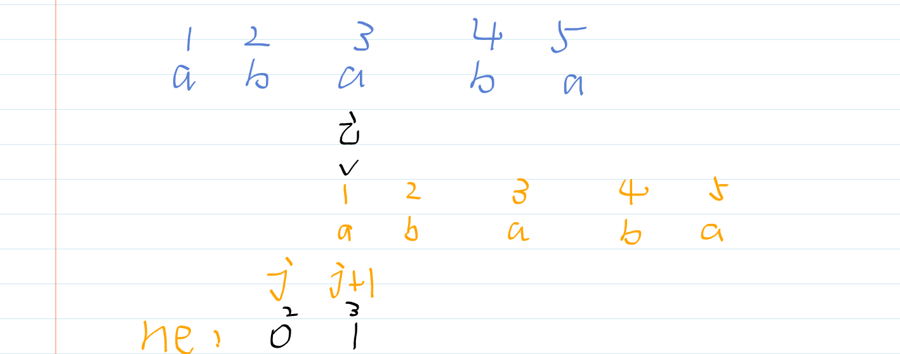
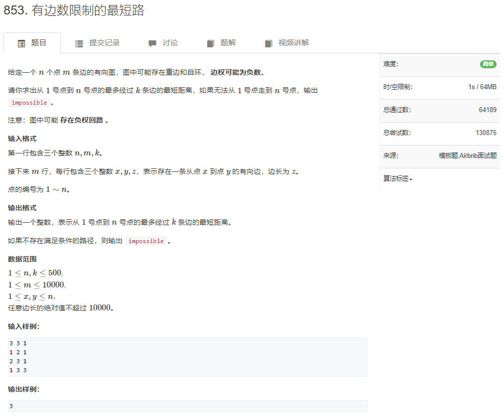
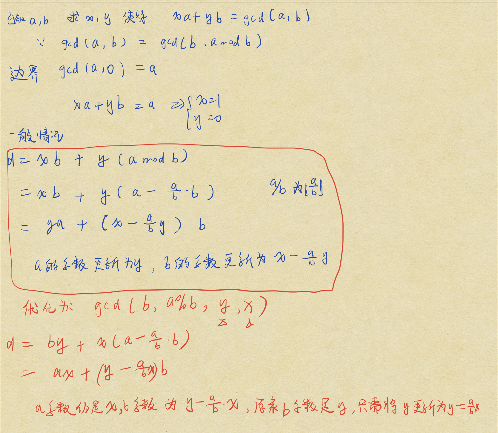

# Tips

## 输入输出

输入输出大于等于1e6使用`scanf`,否则使用`cin`


加速`cin`,但仍没有`scanf`快速

1.取消同步:

```c++
ios::sync_with_stdio(false);
std::cin.tie(0);
```

2.取消后不能使用`scanf`,只能`cin`


## 特殊样例的读入

``` cpp
#include <iostream>
#include <vector>
#include <sstream> // stringstream 分割字符串
#include <istream>
#include <string>

using namespace std;

//  数组以空格分割,已知只有三行,每行个数未知
//   Sample Input
// 1 2 3 4 5
// 11 12 13 14 15
// 21 22 23 24 25


void test1()
{
    vector<vector<int>> res(3);
    for(int i = 0; i < 3; ++ i)
    {
        int a;
        // 空白字符:空格,换行,tab
        // cin 读入数据 1如果第一个读到空白字符,将忽略并清除这个空白字符
        //              2如果第一个读到了非空白字符,将读入整个字符串或者字符,直到遇到空白字符
        //              (但这个空白字符不会被清除,残留在缓冲区)或eof
        while(cin >> a) 
        {
            // if(a == '\n') break;
            cout << "current:" << a << endl;
            res[i].push_back(a);    
        }
    }

    cout << "res:" << endl;
    for(auto &v : res)
        for(auto &e : v){
            cout << e << " ";
        }
    cout << endl;
            
}

// 未知数组长度，用 ',' 隔开
// Sample Input
// [1,2,3,4,5,6,7]
// [0,2,3,4,5,7,3]
 
void test2()
{
    vector<int> v1,v2;

    string s1,s2;
    cin >> s1 >> s2;
    cout << "s2=" << s2 << endl;

    s1 = s1.substr(1,s1.size() - 2);
    s2 = s2.substr(1,s2.size() - 2);

    stringstream ss;
    ss << s1;
    
    string temp;
    while (getline(ss,temp,','))
    {
        v1.push_back(stoi(temp));
    }

    ss.clear();
    ss << s2;
    while (getline(ss,temp,','))
    {
        v2.push_back(stoi(temp));
    }
    
    for(auto &e : v1) cout << e << " ";
    cout << endl;

    for(auto &e: v2) cout << e << " ";
    cout << endl;
}
```


## 读入一个字符

使用

```c++
char op[2]; 
scanf("%s",&op); // 忽略回车等字符
```

而不是(因为会读入回车等字符)

``` c++
char op;
scanf("%s",&op);
```


## printf输出string

````c++
string s = "abc";
printf("%s",s.c_str()); // c_str()返回string s的首地址
````


## 清空没有clear函数的stl容器

`queue` ,`priority queue` ,`stack` 没有clear函数

```c++
q = queue<int>(); // 想要清空q,直接重新构造一个
```


## c++默认大根堆

从小到大插入需要修改堆的次数少,因此`greater`是小根堆

```c++
priority_queue<int, vector<int>, less<int>>s;//less表示按照递减(从大到小)的顺序插入元素 实现为大根堆(默认)
priority_queue<int, vector<int>, greater<int>>s;//greater表示按照递增（从小到大）的顺序插入元素 实现为小根堆
```


## 数组越界什么错误都可能发生,把数组开大一些

segmentation fault

Time Limit Exceeded


## 时间复杂度表


 **计算速度:C++ 一般1s计算$10^{7}$到$10^{8}$次**


## 从大到小排序

定义一个函数

``` cpp
bool cmp(int x,int y)
{
	return x > y;
}
```

使用时将其作为第三个参数

``` cpp
sort(arr,arr + 10,cmp);
```


或者直接

``` cpp
sort(arr, arr + 5, greater<int>());
```


# 一.基础算法

## class1

### 二分查找

* 循环结束时,left必须等于right

* 两种模板,每次迭代时将区间分为两个部分,这两个部分的边界值很重要,决定了mid的计算方式
  * 将区间更新为`[mid:right]`和`[left,mid-1]`,此时mid向上取整
  * 将区间更新为`[mid+1:right]`和`[left,mid]`,此时mid向下取整
* 关于`>=`还是`>`,在含有等号的判断语句中,不能更新mid-1或者mid+1

```java
//1.向上取整
public int search1(int[] nums, int target) {
    int left = 0,right = nums.length - 1, mid = -1;
    while(left < right){
        mid = left + right + 1 >> 1;
        if(target >= nums[mid]) left = mid; // =号的判断,target等于当前值,将当前下标返回
        else right = mid - 1; //收缩右边界,如果有多个答案,最终找到的是从右向左的第一个答案
    }
    return nums[left] == target ? left:-1;
}

//2.向下取整
public int search2(int[] nums, int target) {
    int left = 0,right = nums.length - 1, mid = -1;
    while(left < right){
        mid = left + right >> 1;
        if(target > nums[mid]) left = mid + 1; //收缩左边界,最终找到从左向右第一个答案
        else right = mid;
    }
    return nums[left] == target ? left:-1;
}	
```

> 当right=left+1时,情况1,以left=1,right=2为例,mid=1+2>>1=1 [1:2],[0:1]此时的区间划分就出错了

### 快速排序

**该算法不能使用pivot的下标，最后j并不代表是pivot的下标处**

``` c++
#include <iostream>

using namespace std;

const int N = 1e5 + 10;

int q[N];
int n;

void quick_sort(int q[],int l,int r)
{
    if(l >= r) return;
    //数据加强,pivot取中点
    int pivot = q[(l + r) / 2],i = l - 1,j = r + 1; //初值在[l,r]外
    
    while(i < j){
        // 等于pivot时也要交换,
        do i++; while(q[i] < pivot);
        do j--; while(q[j] > pivot);
        // i < j 才进行交换
        if(i < j) swap(q[i],q[j]);
    }
    
    quick_sort(q,l,j);
    quick_sort(q,j+1,r);
    
}

int main()
{
    scanf("%d",&n);
    for(int i  = 0; i < n;i++){
        scanf("%d",&q[i]);
    }
    
    quick_sort(q,0,n-1);
    
    for(int i = 0;i < n;i++){
        printf("%d ",q[i]);
    }
    return 0;
}
```

* 设置`i,j初值在待处理数组外`以及先`do i++,j--`的原因是防止出现`i,j`同时指向了两个等于`pivot`值的元素,比如[1,1]

  * 采用如下代码结构,会出现死循环

    ```c++
        //错误的代码
    	int pivot = q[l + r >> 1],i = l,j = r;
        while(i < j){
            while(q[i] < pivot) ++i;
            while(q[j] > pivot) --j;
            if(i < j) swap(q[i],q[j]);
        }
    ```

    

  * **进一步,swap后,i和j指向的元素已经交换过了,那么一定是符合顺序的,因此要先自增/减**

* 等于pivot的元素处理

  * ```c++
        while(i < j){
            // 等于pivot时也要交换
            do i++; while(q[i]<pivot);
            do j--; while(q[j]>pivot); //循环时,j后于i定位,因此j
            if(i < j) swap(q[i],q[j]);
        }
    // 在退出循环后,i>=j
    	quick_sort(q,l,j);
        quick_sort(q,j+1,r);
    ```

  * 

注意:使用用例 2 [1,2]验证1和2,本质是**按照i进行回溯时划分`pivot`不能取到nums[l],按照j划分不能取到nums[r]**,因为i是从左向右遍历,如果第一个元素就是pivot,那么回溯时,区间为(l,i-1)即(0,-1),和(l,r)陷入死循环;

1.

``` c++
quick_sort(q,l,j);
quick_sort(q,j+1,r);
```

对应`int pivot = q[(l+r)/2]`

2.

```c++
quick_sort(q,l,i-1);
quick_sort(q,i,r);
```

对应` int pivot = q[l + r + 1 >> 1]`


### 归并排序


时间复杂度O(nlogn),分析:

* 将数据从n分到1,一共分了logn次;
* 每一层使用双指针排序,时间复杂度之和为O(n),以n/4为例就是4个O(n/4)结果为O(n);


```c++
#include <iostream>

using namespace std;

const int N = 100010;
int n,q[N],temp[N];

void merge_sort(int q[],int l,int r)
{
    if(l >= r) return;
    int mid = l + r >> 1; 
    merge_sort(q,l,mid);merge_sort(q,mid + 1,r);
    int i = l,j = mid + 1,k = 0;
    while(i <= mid && j <= r)
    {
        if(q[i] < q[j]) temp[k++] = q[i++];
        else temp[k++] = q[j++];
    }
    while(i <= mid) temp[k++] = q[i++];
    while(j <= r) temp[k++] = q[j++];
    for(k = 0,i = l;i <= r;i++,k++) q[i] = temp[k];
}

int main()
{   
    scanf("%d",&n);
    for(int i = 0;i < n; ++i)
    {
        scanf("%d",&q[i]);
    }
    merge_sort(q,0,n - 1);

    for(int i = 0;i < n; ++i)
    {
        printf("%d ",q[i]);
    }
}
```


## class2

### 大整数加法

```c++
#include <iostream>
#include <vector>

using namespace std;

vector<int> add(vector<int> &A,vector<int> &B)
{
    vector<int> C;
    //保证A为较长的一个vector
    if(A.size() < B.size()) return add(B,A);
    int temp = 0;
    for(int i = 0; i < A.size(); i ++)
    {
        temp += A[i];
        if(i < B.size()) temp += B[i];
        C.push_back(temp % 10);
        temp /= 10;
    }
    if(temp) C.push_back(temp % 10);
    return C;
}   

int main()
{   
    string a,b; 
    vector<int> A,B;
    cin >> a >> b; //123456
    for(int i = a.size() - 1; i >= 0; -- i) A.push_back(a[i] - '0'); 
    for(int i = b.size() - 1; i >= 0; -- i) B.push_back(b[i] - '0');

    vector<int> C = add(A,B);
    for(int i = C.size() - 1; i >= 0; -- i) cout << C[i];
    return 0;
}
```

### 减法

``` c++
#include <iostream>
#include <vector>

using namespace std;

// A >= B ?
bool cmp(vector<int> &A,vector<int> &B)
{
    if(A.size() != B.size()) return A.size() > B.size();
    // AB等长
    for(int i = A.size() - 1; i >= 0; -- i)
    {
        if(A[i] != B[i]) return A[i] > B[i];
    }
    // A == B
    return true;
}

// A > B的情况下相减
vector<int> sub(vector<int> &A,vector<int> &B)
{
    vector<int> C;
    for(int i = 0,t = 0; i < A.size(); i ++)
    {
        t = A[i] - t;
        if(i < B.size()) t -= B[i];
        // t属于(-10,10) t>0 返回t;t<0 返回 10+t
        C.push_back((t + 10) % 10); 
        // 重置借位
        if(t >= 0) t = 0;
        else t = 1;
    }
    // 去掉高位0,除非只有一位0
    while(C.size() > 1 && C.back() == 0) C.pop_back();
    return C;
}

int main()
{
    vector<int> A,B;
    string a,b;
    cin >> a >> b; 
    // 注意转换char为int
    for(int i = a.size() - 1; i >= 0; -- i) A.push_back(a[i] - '0'); 
    for(int i = b.size() - 1; i >= 0; -- i) B.push_back(b[i] - '0');
    vector<int> C;
    if(cmp(A,B)){
        C = sub(A,B);
    }
    else
    {
        printf("-");
        C = sub(B,A);
    }
    for(int i = C.size() - 1; i >= 0; i --) printf("%d",C[i]);
}
```


### 乘法

```c++
#include <iostream>
#include <vector>

using namespace std;

vector<int> mul(vector<int> &A,int b)
{
    vector<int> C;
    int t = 0;
    for(int i = 0; i < A.size(); ++ i)
    {
        t += A[i] * b;
        C.push_back(t % 10);
        t /= 10;
    }
    while(t){
        C.push_back(t % 10);
        t /= 10;
    }
    // 去掉前导0
    while(C.size() > 1 && C.back() == 0) C.pop_back();
    return C;
}
int main()
{
    int b;
    string a;
    vector<int> A;
    cin >> a >> b;
    for(int i = a.size() - 1; i >= 0; i --) A.push_back(a[i] - '0');
    vector<int> C = mul(A,b);
    for(int i = C.size() - 1; i >= 0; i --) printf("%d",C[i]);
    return 0;
}
```


### 除法

``` c++
#include <iostream>
#include <vector>
#include <algorithm>

using namespace std;

vector<int> div(vector<int> &A,int b,int & r)
{   
    vector<int> C;
    // 除法从高位开始
    for(int i = A.size() - 1; i >= 0; i -- ){
        // 本轮要处理的数之和
        r = r * 10 + A[i]; 
        C.push_back(r / b);
        // 得到本轮余数
        r %= b;
    }
    // 去除前导0,因为从高向低计算,前导0在数组低位
    reverse(C.begin(),C.end());
    while(C.size() > 1 && C.back() == 0) C.pop_back();
    return C;
}

int main()
{   
    string a;
    vector<int> A;
    int b;
    cin >> a >> b; // a = 123
    for(int i = a.size() - 1; i >= 0; i --) A.push_back(a[i] - '0'); //A = 321
    int r = 0; // 余数
    vector<int> C = div(A,b,r);

    for(int i = C.size() - 1; i >= 0; i --) printf("%d",C[i]);
    cout << endl << r << endl;
    return 0;
}
```


### 前缀和


构造前缀和一般从下标1开始,输入数组读入`num[1:n]`,前缀和[1,n],前缀和数组的下标0是默认初始化为0

```c++
#include <iostream>

using namespace std;

const int N = 1e5 + 10;
int n,m;
int a[N],s[N];

int main ()
{
    scanf("%d%d",&n,&m);
    // 将数据读入到a[1:n]
    for(int i = 1; i <= n; i ++) scanf("%d",&a[i]);
    // s[0]为0,定义s[0:n],实际数值从下标1开始记录,
    // 求a[1,10] = s[10] - s[0]不需要判断边界
    for(int i = 1; i <= n; i ++) s[i] = s[i - 1] + a[i];
    
    while(m --){
        int l,r;
        scanf("%d%d",&l,&r);
        printf("%d\n",s[r] - s[l - 1]);
    }
    return 0;
}
```


二维前缀和

```c++
#include <iostream>

using namespace std;

const int N = 1010;
int num[N][N],n,m,q,prefix[N][N];

int main()
{
    scanf("%d%d%d",&n,&m,&q);

    for(int i = 1; i <= n; i ++)
        for(int j = 1; j <= m; j ++)
            scanf("%d",&num[i][j]);
    
    //生成前缀和
    for(int i = 1; i <= n; i ++)
        for(int j = 1; j <= m; j ++)
            prefix[i][j] = 
                prefix[i - 1][j] 
                + prefix[i][j - 1] 
                - prefix[i - 1][j - 1] 
                + num[i][j];

    while(q --){
        int x1,y1,x2,y2;
        scanf("%d%d%d%d",&x1,&y1,&x2,&y2);
        printf("%d\n",
            prefix[x2][y2] 
            - prefix[x1 - 1][y2] 
            - prefix[x2][y1 - 1] 
            + prefix[x1 - 1][y1 - 1]
        );
    }
    return 0;
}
```

### 差分

差分数组：

首先给定一个原数组a：a[1], a[2], a[3],,,,,, a[n];

然后我们构造一个数组b ： b[1] ,b[2] , b[3],,,,,, b[i];

使得 a[i] = b[1] + b[2 ]+ b[3] +,,,,,, + b[i]

也就是说，a数组是b数组的前缀和数组，反过来我们把b数组叫做a数组的差分数组。换句话说，每一个a[i]都是b数组中从头开始的一段区间和


构建方法:

a[0 ]= 0;

b[1] = a[1] - a[0];

b[2] = a[2] - a[1];

b[3] =a [3] - a[2];

........

b[n] = a[n] - a[n-1];


**差分是前缀和的逆运算**

构建一个原数组a的差分b,对于a[l,r]整体元素+c,只需要在差分数组b中修改两个位置(b[l],b[r + 1]):


## class3


### n的二进制表示中第k位是多少


### 获取二进制位上的低位1

补码中-x是~x + 1

假设x的补码是`1010`,则-x的补码是`~(x)+1`,即`0110`


801题:

```c++
#include <iostream>

using namespace std;

// 获取最低位的值
int lowbit(int x)
{
    return x & -x;
}

int main()
{
    int n;
    cin >> n;
    while( n--){
        int x,c = 0;
        cin >> x;
        while(x > 0){
            x -= lowbit(x);
            ++c;
        }
        cout << c << " ";
    }
    return 0;
}
```


### 离散化	

整个值域跨度很大,但实际用到的数字很少


802:

黑色点都是没有用到的数

因此只将要用到的数(本题目中是查询区间和插入数据的位置,即彩色部分)存入数组中,将这个连续的数轴变得离散了


```c++
#include <iostream>
#include <vector>
#include <algorithm>

using namespace std;

// n次插入操作,m次询问,每次询问是一个区间,数据量是n+2m
const int N = 300010;
int a[N],s[N]; // 前缀和中的原数组a和前缀和数组s

int n,m;

vector<pair<int,int>> add; // 读取插入
vector<pair<int,int>> query; // 读取询问
vector<int> alls; // 存储数字

// 查找x对应在a数组的下标
int find_index(int x)
{
    int l = 0,r = alls.size() - 1;
    while(l < r){
        int mid = l + r + 1 >> 1;
        if(x < alls[mid]) r = mid - 1; 
        else l = mid;   
    }
    return r + 1; // 前缀和数组下标从1开始
}

// vector<int>::iterator unique(vector<int> &a){
//     int j = 0;
//     for(int i = 0; i < a.size(); ++i){
//         if(!i || a[i] != a[i - 1])
//             a[j ++] = a[i];
//     }
//     return a.begin() + j;
// }

int main()
{
    cin >> n >> m;
    for(int i = 0; i < n; ++i){
        int x,c;
        cin >> x >> c;
        add.push_back({x,c});
        alls.push_back(x);
    }

    for(int i = 0; i < m; ++i){
        int l,r;
        cin >> l >> r;
        query.push_back({l,r});
        // 左右区间也要插入a数组中
        alls.push_back(l);
        alls.push_back(r);
    }
    
    // 对存储的数字排序去重
    sort(alls.begin(),alls.end());
    alls.erase(unique(alls.begin(),alls.end()),alls.end());
    
    // 处理插入
    for(auto item : add){
        int r = find_index(item.first);
        a[r] += item.second;
    }
    
    // 生成前缀和数组
    for(int i = 1; i <= alls.size(); ++i){
        s[i] = s[i - 1] + a[i];
    }
    
    // 处理查询
    for(auto p : query){
        int l = find_index(p.first);
        int r = find_index(p.second);
        cout << s[r] - s[l - 1] << endl;
    }
    return 0;
}

```

自己定义unique

```c++
vector<int>::iterator unique(vector<int> &a){
    int j = 0;
    for(int i = 0; i < a.size(); ++i){
        if(!i || a[i] != a[i - 1])
            a[j ++] = a[i];
    }
    return a.begin() + j;
}
```


### 区间合并


按区间左边界大小排序,然后根据当前区间的右边界和循环遍历的区间左边界进行比较


```c++
#include <iostream>
#include <vector>
#include <algorithm>

using namespace std;

int n;
vector<pair<int,int>> segs;

void merge(vector<pair<int,int>> &segs)
{   
    // pair按照first,然后second(first相等)的方式排序
    sort(segs.begin(),segs.end());

    // 定义一个最小值,最小数据是-1e9
    int bg = -2e9,ed = -2e9;
    // 存储当前待处理的区间
    vector<pair<int,int>> ans;
    for(auto seg : segs){
        if(ed < seg.first){
            if(ed != -2e9) ans.push_back({bg,ed});
            bg = seg.first;
            ed = seg.second;
        }else{
            ed = max(ed,seg.second);
        }
    }
    // 防止segs为空
    if(bg != -2e9) ans.push_back({bg,ed});
    
    segs = ans;
}

int main()
{
    cin >> n;
    while(n --){
        int l,r;
        cin >> l >> r;
        segs.push_back({l,r});
    }

    merge(segs);

    cout << segs.size();
    return 0;
}
```


# 二.栈与队列

不能使用结构体实现的栈和队列


## class1

### 单链表

用两个数组模拟单链表


```c++
#include <iostream>

using namespace std;

const int N = 1e5 + 10;
// e表示元素,ne为存有下一个位置下标的数组,head指向第一个位置,idx是当前插入的尾后下标
int e[N],ne[N],head,idx;

void init()
{
    head = -1;
    // idx = 0;
}

void add_to_head(int x)
{
    e[idx] = x;
    ne[idx] = head;
    head = idx++;
}

// 删除下标是k的节点的后一个数
void remove(int k)
{
    ne[k] = ne[ne[k]];
}

// 在下标是k的节点后插入一个元素
void add(int k,int x)
{
    e[idx] = x;
    ne[idx] = ne[k];
    ne[k] = idx++;
}

int main()
{
    init();
    char op;
    int m,x,k;
    cin >> m;
    while(m --){
        cin >> op;
        if(op == 'H'){
            cin >> x;
            add_to_head(x);
        }else if(op == 'I'){
            cin >> k >> x;
            // 第1个数插入下标0的位置
            add(k - 1,x);
        }else{
            cin >> k;
            // 注意删除头结点指向元素的情况
            if(!k) head = ne[head];
            else remove(k - 1);
        }
    }

    for(int i = head; ne[i] != -1; i = ne[i]){
        cout << e[i] << " ";
    }
    cout << endl;
    return 0;
}
```


### 双向链表

``` c++
#include <iostream>

using namespace std;

const int N = 100010;
int l[N],r[N],e[N],idx;

// 下标0代表head,下标1代表tail
void init()
{
    r[0] = 1;
    l[1] = 0;
    idx = 2;
}

// 删除节点k
void remove(int k)
{
    r[l[k]] = r[k];
    l[r[k]] = l[k];
}

// 在k节点的右边插入一个x
void insert(int k,int x)
{
    e[idx] = x;
    l[idx] = k;r[idx] = r[k];
    l[r[k]] = idx;
    r[k] = idx++;
}

int main()
{
    init();

    int m,x,k;
    string op; // 注意op是字符串
    cin >> m;
    while(m -- ){
        cin >> op;
        if(op == "L"){
            cin >> x;
            insert(0,x);
        }else if(op == "R"){
            cin >> x;
            insert(l[1],x);
        }else if(op == "D"){
            cin >> k;
            // 第1个插入的数下标为2
            remove(k + 1);
        }else if(op == "IL"){
            cin >> k >> x;
            // 查找左边元素用l[]
            insert(l[k + 1],x);
        }else {
            cin >> k >> x;
            insert(k + 1,x);    
        }
    }
    for(int i = r[0]; i != 1; i = r[i]) cout << e[i] << " ";
    cout << endl;
    
    return 0;
}
```

### 栈

```c++
#include <iostream>

using namespace std;

// tt指向栈顶元素,有效元素从1开始
const int N = 100010;
int stk[N],tt;

// void push(int x)
// {
//     stk[++tt] = x;
// }

// void pop()
// {
//     --tt;
// }

// bool empty()
// {
//     return tt == 0;
// }

// int top()
// {
//     return stk[tt];
// }

int main()
{
    int m,x;
    cin >> m;
    string op;
    while(m --){
        cin >> op;
        if(op == "push"){
            cin >> x;
            stk[++tt] = x;
        }else if(op == "pop"){
            --tt;
        }else if(op == "query"){
            cout << stk[tt] << endl;
        }else {
            if(tt == 0) cout << "YES";
            else cout << "No";
            cout << endl;
        }
    }
}
```

### 队列 

``` c++
#include <iostream>

using namespace std;

// qu[he:ta]为队列
const int N = 100010;
int qu[N],he,ta = -1;

int main()
{
    int m,x;
    cin >> m;
    string op;
    while(m --){
        cin >> op;
        if(op == "push"){
            cin >> x;
            qu[++ ta] = x;
        }else if(op == "pop"){
            ++he;
        }else if(op == "query"){
            cout << qu[he] << endl;
        }else {
            cout << (he > ta ? "YES":"NO") << endl;
        }
    }
}
```

### 单调栈

思考暴力解法,两次for循环

```
for(int i = 0;i < n; ++i)
	for(int j = i - 1; j >=0 ; --j)
		if(aj < ai) cout << j << " "
```

第二层循环是从后向前,其实是一个栈,这个栈有元素`[0,i-1]`,i-1是栈顶

栈中元素有两个维度的比较,是否小于ai以及下标是否最靠近i

对于栈中元素,假设A1 >= A3,A3小于A1,而且3的下标更靠近i,在两个维度的优先级都高于A1,A1一定不会被选择,将这些"A1"去掉,这个栈就变成了单调栈


``` C++
#include <iostream>

using namespace std;
const int N = 100010;
int stk[N],tt;

int main()
{
    int n,x;
    cin >> n;
    while(n --){
        cin >> x;
        while(tt && x <= stk[tt]) --tt;
        if(tt == 0) cout << -1 << " ";
        else cout << stk[tt] << " ";
        stk[++tt] = x;
    }
    return 0;
}
```


### 单调队列

``` c++
#include <iostream>

using namespace std;

const int N = 1000010;
int a[N],q[N],n,k;

int main()
{
    int hh = 0,tt = -1;

    scanf("%d%d",&n,&k);
    for(int i = 0;i < n; ++i) scanf("%d",&a[i]);

    for(int i = 0;i < n; ++i){
        // 滑动窗口左端先出队本题最多出队一个元素
        // 而且队首是最可能出队的元素,因此用if
        if(hh <= tt && q[hh] < i - k + 1) ++hh;
        // 找到一个小于当前的元素的位置作为队尾
        while(hh <= tt && a[q[tt]] >= a[i]) --tt;
        q[++tt] = i;
        if(i >= k - 1) printf("%d ",a[q[hh]]);
    }
    puts("");


    hh = 0,tt = -1;
    for(int i = 0;i < n; ++i){
        // 滑动窗口左端先出队
        if(hh <= tt && q[hh] < i - k + 1) ++hh;
        // 找到一个大于当前的元素的位置作为队尾
        while(hh <= tt && a[q[tt]] <= a[i]) --tt;
        q[++tt] = i;
        if(i >= k - 1) printf("%d ",a[q[hh]]);
    }
    return 0;
}
```


### KMP

```c++
#include <iostream>

using namespace std;

// s[1:n],p[1:n]为字符串范围
const int N = 100010,M = 1000010;
char s[M],p[N];
int m,n,ne[N];

int main()
{
    cin >> n >> p + 1 >> m >> s + 1;
    // 生成next数组,ne[1] = 0;
    // 计算前后缀,前后缀长度小于串的长度,
    // 当前子串至少长度为2才有计算的必要
    for(int i = 2,j = 0; i <= n; ++i){
        while(j && p[i] != p[j + 1]) j = ne[j];
        if(p[i] == p[j + 1]) ++j;
        ne[i] = j;
    }

    // 模式匹配,j=0代表不能回退的状态
    for(int i = 1,j = 0; i <= m; ++i){
        // 如果失配,j向前回退,直到匹配或者不能再退 
        while(j && s[i] != p[j + 1]) j = ne[j];
        if(s[i] == p[j + 1]) ++j;
        if(j == n){
            // 匹配成功
            // 要求返回的下标是从0开始计算的
            printf("%d ",i - n);
            j = ne[j];
        }
    }
    return 0;
}
```


next数组的生成过程:

* 使用匹配串p和p自己比较,从第二个字母开始,p1[i]指向的是后缀(蓝色),p2[i]指向前缀
* 由于字符串长度大于其前后缀长度,因此是从字符串长度为2开始匹配
* `j == 0`表示当前情况下不能使用next数组回退,使用`j+1`指向当前比较的元素


比较`ab`,找出最长的前后匹配的前缀和后缀


比较`aba`



比较`abab`


比较`ababa`


## class2

### trie树


使用数组实现:

```c++
#include <iostream>

using namespace std;

// son相当于链表的next数组,idx给节点赋唯一值,
// cnt是元素数组cnt[x]记录son[x]对应的字符串有几个
// son[0]表示起始节点,是空节点
// son[a][b]为0表示没有该节点
const int N = 100010;
int son[N][26],idx,cnt[N];
char str[N];

void insert(char str[])
{
    int p = 0;
    for(int i = 0; str[i]; ++i){
        int u = str[i] - 'a';
        if(!son[p][u]) son[p][u] = ++idx; // 指向son[++idx]的位置
        p = son[p][u]; // p作为第一个索引值,下次循环会索引到son[idx]处
    }
    ++cnt[p]; // p对应位置的元素自增
}

int query(char str[])
{
    int p = 0;
    for(int i = 0; str[i]; ++i){
        int u = str[i] - 'a';
        if(!son[p][u]) return 0;
        p = son[p][u];
    }
    return cnt[p];
}

int main()
{
    int n;
    char op[2];
    scanf("%d",&n);    
    while(n -- ){
        scanf("%s%s",&op,&str); // c风格字符串末尾有'/0',不能直接和"I"比较
        if(*op == 'I'){
            insert(str);
        }else{ 
            cout << query(str) << endl;
        }
    }
    return 0;
}
```


### 并查集


优化:

**路径压缩:在找到一个节点的根后,将该路径上所有节点的父节点定义为根**


``` c++
#include <iostream>

using namespace std;

const int N = 100010;
// 只有根节点的size才是有效的
int p[N],n,m,sz[N];

// 查找x的根节点值,定义根节点值=所属集合的值,并采用路径压缩
int find(int x)
{
    // 注意是if不是循环
    if(x != p[x]) p[x] = find(p[x]);
    return p[x];
}

int main()
{
    scanf("%d%d",&n,&m);
    
    // 初始化并查集
    for(int i = 1; i <= n; ++i){
        p[i] = i;
        sz[i] = 1;
    }
    char op[5];
    int a,b;
    while(m --){
        scanf("%s",&op);
        if(*op == 'C'){
            // 连通a和b,实际上就是合并两者所在集合
            scanf("%d%d",&a,&b);
            // 不能合并在同一个连通块的元素,size会重复合并
            if(find(a) != find(b)) {
                sz[find(b)] += sz[find(a)];
                p[find(a)] = find(b);
            }
        }else if(op[1] == '1'){
            scanf("%d%d",&a,&b);
            if(find(a) == find(b)) puts("Yes");
            else puts("No");
        }else {
            scanf("%d",&a);
            printf("%d\n",sz[find(a)]);
        }
    }
    return 0;   
}
```


### 堆排序

使用数组实现小堆 


删除头元素

```cpp
swap(h[1],h[sz--]);
down(1);
```

插入元素

```c++
h[++sz] = x;
up(sz);
```

删除任意一个元素k

```c++
swap(h[k],h[sz]);
--sz;
down(k); up(k); // down和up只会执行其中一个
```

修改一个元素k

```c++
h[k] = x;
down(k); up(k);
```


使用`down()`在`2/n`的位置建堆

```c++
// 建立堆,堆是完全二叉树,最后一行不用down
// 从倒数第二行开始执行down操作
// 时间复杂度是O(n)
for(int i = n / 2; i; -- i){
    down(i);
}
```


找到最后一个节点位置,假设该节点是y,设它的根节点下标是x,有

`y = 2*x `或者 `y = 2*x + 1`

因此n/2的位置一定是最后一个节点的根节点位置,**最后一层元素以及倒数第二层没有子节点的位置不需要down操作**

上图中,y=13,x=6,节点7不需要down操作

建堆的时间复杂度分析:


```c++
#include <iostream>

using namespace std;

const int N = 100010;
int h[N],m,n,sz;

// 将下标为x的元素做down操作
void down(int x)
{
    int u = x;
    if(2 * x <= sz && h[u] > h[2 * x]) u = 2 * x;
    if(2 * x + 1 <= sz && h[u] > h[2 * x + 1]) u = 2 * x + 1;
    if(u != x) {
        swap(h[x],h[u]);
        down(u);
    }
}

void up(int x)
{
	while(x / 2 && h[x / 2] > h[x]){
        swap(h[x / 2],h[x]);
        x /= 2;
    }
}

int main()
{
    scanf("%d%d",&n,&m);
    // 数组建堆从1开始,左节点是2*x,右节点是2*x+1
    for(int i = 1; i <= n; ++ i) scanf("%d",&h[i]);
    sz = n;

    // 建立堆,堆是完全二叉树,最后一行不用down
    // 从倒数第二行开始执行down操作
    // 时间复杂度是O(n)
    for(int i = n / 2; i; -- i){
        down(i);
    }
    while(m -- ){
        // 数组中删除头元素很难,但删除末尾元素容易
        printf("%d ",h[1]);
        swap(h[1],h[sz--]);
        down(1);
    }
    return 0;
}
```


需要维护插入顺序到heap节点映射的堆实现

```c++
#include <iostream>
#include <algorithm>
#include <cstring>

using namespace std;

const int N = 100010;
// p2h[x]表示第x个插入的元素在heap的哪个节点
// h2p[x]表示heap中下标为x的元素是第几个插入的
int h[N],p2h[N],h2p[N],sz;

// 交换两个节点,更新两个映射数组
void heap_swap(int a,int b)
{
    swap(p2h[h2p[a]],p2h[h2p[b]]);
    swap(h2p[a],h2p[b]);
    swap(h[a],h[b]);
}

// 对节点x做down
void down(int x)
{
    int u = x;
    // 用h[u]比较,因为u在中途可能改变
    if(2 * x <= sz && h[2 * x] < h[u]) u = 2 * x;
    if(2 * x + 1 <= sz && h[2 * x + 1] < h[u]) u = 2 * x + 1;
    if(u != x){ 
        heap_swap(u,x);
        down(u);
    }
}

// 对节点x做up
void up(int x)
{
    while(x / 2 && h[x / 2] > h[x]){
        heap_swap(x / 2,x);
        x /= 2;
    }
}

int main()
{
    int n,p = 0;
    char op[5];
    scanf("%d",&n);
    while(n --){
        int k,x;
        scanf("%s",&op);
        if(!strcmp(op,"I")){
            scanf("%d",&x);
            ++sz;
            ++p;
            p2h[p] = sz,h2p[sz] = p;
            h[sz] = x;
            up(sz);
        }else if(!strcmp(op,"PM"))
        {
            printf("%d\n",h[1]);
        }else if(!strcmp(op,"DM"))
        {
            heap_swap(1,sz); 
        // 注意sz操作要在down,up之前
            --sz;
            down(1);
        }else if(!strcmp(op,"D"))
        {
            scanf("%d",&k);
            k = p2h[k];
            heap_swap(k,sz);
            --sz;
            up(k);
            down(k);
        }else
        {
            scanf("%d%d",&k,&x);
            k = p2h[k];
            h[k] = x;
            up(k);
            down(k);
        }
    }
    return 0;
}
```


## class3

### 哈希表

* hashmap的大小N就是取模的值,这个值最好是质数,而且不要靠近2的整数次幂

```c++
#include <iostream>

using namespace std;

// 找出>=n的最小质数
int main()
{
    int n = 100000;
    for(int i = n;;++i)
    {
        bool flag = true;
        for(int j = 2; j * j <= i; ++j)
        {
            if(i % j == 0)
            {
                flag = false;
                break;
            }
        }
        if(flag) {
            cout << i << endl;
            break;
        }
    }
    return 0;
}

```

#### 拉链法

* 拉链法,使用头插法在hashmap的每一个位置存一个指向链表第一个元素的指针

* 使用-1作为空指针的标记

``` c++
#include <iostream>
#include <cstring>

using namespace std;
// N定义为质数,且远离2的次幂
const int N = 100003; 

// h为hashmap,其余部分维护hashmap上每个节点的链表  
int h[N],e[N],ne[N],idx; 

bool find(int x)
{
    int k = (x % N + N) % N;
    for(int i = h[k]; i != -1; i = ne[i])
        if(e[i] == x) return true;
    return false;
}   

void insert(int x)
{   
    // 将[1e-9,1e9] 映射到 [0,N - 1]
    // x % N 可能是负数,因此再加N模N
    int k = (x % N + N) % N;
    // h[k] 指向链表中第一个元素,h[k]初始化的-1会被传递给链表末尾
    e[idx] = x;ne[idx] = h[k];h[k] = idx++;
}

int main()
{
    int n;
    scanf("%d",&n);

    // 定义-1是空指针
    memset(h,-1,sizeof h);

    while(n--)
    {
        char op[2];int x;
        scanf("%s%d",&op,&x);
        if(*op == 'I')
        {
            insert(x);
        }
        else
        {
            if(find(x)) printf("Yes\n");
            else printf("No\n");
        }
    }
    return 0;
}
```

#### 开放定址法

* 映射后,如果哈希冲突,则查找该位置的下一位置,以此类推
* 需要2-3倍数据量的空间
* map中存输入数据,需要定义一个不在输入数据范围的值作为位置为空的flag

```cpp
#include <iostream>
#include <cstring>

using namespace std;

// N要开数据量的两倍,定义一个不在[1e-9,1e9]的数据作为空闲位置的标记
const int N = 200003,null = 0x3f3f3f3f;
int h[N];

// 查找x,如果x不在哈希表中,返回一个它应该在的位置
int find(int x)
{
    int k = (x % N + N) % N;
    while(h[k] != null && h[k] != x)
    {
        ++k;
        // 当到hashmap末尾,将k定义回开头
        if(k == N) k = 0;
    }
    return k;
}

int main()
{
    int n;
    scanf("%d",&n);
    // 按照字节赋值,填充h
    memset(h,0x3f,sizeof h);

    while(n--)
    {
        char op[2];int x;
        scanf("%s%d",&op,&x);
        int r = find(x);
        if(*op == 'I')
        {   
            h[r] = x;            
        }
        else
        {
            if(h[r] != null) printf("Yes\n");
            else printf("No\n");
        }
    }
    return 0;
}
```


### 字符串哈希

使用p进制的方法,将字符串映射为一个数字

* 不能有哈希冲突
* P = 13331 或者 131
* Q = 2^64,可以使用unsigned long long自然溢出
* 字母部分不能映射为0,如果A是0,则AA也是0,一定会冲突,字母部分值没有别的要求,可以不转int
* 快速判断两个字符串是否相等时可以使用


`abcabc`计算验证两个`ab`哈希值是否相同,假定a=1

```
hash[0] = 0
hash[1] = hash(a) = 1
hash[2] = hash(ab) = hash(a) * 131 + 2 = 133
hash[3] = hash(abc) = hash(ab) * 131 + 3 = 17426
hash[4] = hash(abca) = hash(abc) * 131 + 1 = 2,282,807
hash[5] = hash(abcab) = hash(abcab) * 131 + 2 = 299,047,719
hash[6] = hash(abcabc) = hash(abcab) * 131 + 3 = 39,175,251,192
 	
求第一个ab hashcode = hash[2]
求第二个ab hashcode = hash[5] - hash[3]*p^2 = 299,047,719 - 17426 * 131^2 = 133 = hash[2]
```

每一个hash位置的意义是:

下图为例,hash[4]的意义是把abca拿出来作为一个p进制数计算的值


``` c++
#include <iostream>

using namespace std;

typedef unsigned long long ULL;

// p数组预处理各个位上字母的权值
const int P = 131,N = 100010;
ULL h[N],p[N];
char s[N];

ULL get(int l,int r)
{
    return h[r] - h[l - 1]*p[r - l + 1];
}

int main()
{
    int n,m;
    scanf("%d%d%s",&n,&m,s + 1);

    p[0] = 1;
    for(int i = 1; i <= n; ++i)
    {
        p[i] = p[i - 1] * P;
        // 将数据左移一位,低位补当前值
        h[i] = h[i - 1] * P + s[i];
    }
    while(m--)
    {
        int l1,l2,r1,r2;
        scanf("%d%d%d%d",&l1,&r1,&l2,&r2);
        if(get(l1,r1) == get(l2,r2)) puts("Yes");
        else puts("No");
    }
    return 0;
}
```

# 三.搜索与图论

## class1


### BFS DFS

* DFS空间上优于BFS


* BFS具有最短性,DFS没有


数字排序 

``` c++
#include <iostream>

using namespace std;

const int N = 10;
int path[N],n;
bool used[N];

void dfs(int u)
{
    if(u == n)
    {
        for(int i = 0; i < n; ++i) printf("%d ",path[i]);
        puts("");
        return;
    }
    for(int i = 1; i <= n; ++i){
        if(!used[i]){
            path[u] = i;
            used[i] = true;
            dfs(u + 1);
            // path[u] 会在循环中重新赋值,不需要恢复
            used[i] = false;
        }
    }
}

int main()
{
    scanf("%d",&n);
    dfs(0);
}
```


n-皇后

对角线处理


代码:

``` cpp
#include <iostream>

using namespace std;

// 对角线是2n - 1,因此开两倍
const int N = 20; 
// 用于标识列,正对角线(左上到右下),反对角线是否被使用
bool col[N],dg[N],udg[N];
char ans[N][N];
int n;

void dfs(int u)
{
    if(u == n)
    {
        for(int i = 0; i < n; ++i)
        {   
            for(int j = 0; j < n; ++j)
                printf("%c",ans[i][j]);
            puts("");
        }
        puts("");
    }
    for(int i = 0; i < n; ++i)
    {
        if(!col[i] && !dg[u + i] && !udg[u - i + n])
        {
            col[i] = dg[u + i] = udg[u - i + n] = true;
            ans[u][i] = 'Q';
            dfs(u + 1);
            col[i] = dg[u + i] = udg[u - i + n] = false;
            ans[u][i] = '.';
        }
    }
}

int main()
{
    scanf("%d",&n);
    for(int i = 0; i < n; ++i)
        for(int j = 0; j < n; ++j)
            ans[i][j] = '.';
    dfs(0);
}
```

### 图

邻接矩阵是一个二维数组

邻接表为每个节点建立一个链表,内容是**该节点可以指向的节点**,在插入新边`2->3`时,在2的链表采用头插法


### 邻接表

``` cpp
// 邻接表
int h[N],ne[N],e[N],idx;

// parent -> child
void add(int p,int c)
{
    e[idx] = c;
    ne[idx] = h[p];
    h[p] = idx ++; 
    // h 是链表的头结点,由这个头结点可以指向下一位置
    // h存当前节点的idx,
    // idx是节点唯一标识, e[idx]拿到idx的元素,ne[idx]拿到节点的下一位置
}

// 遍历一个节点指向的其他节点的方法
// for(int i = h[u]; i != -1; i = ne[i])
```


* idx是每个节点的标识
  * e[idx]获取到该节点的元素
  * ne[idx]获取到该节点的下一个节点,-1代表null
* 将图抽象为从很多h出发的链表,邻接表为每个节点建立一个链表,内容是**该节点可以指向的节点**
  * 注意如果A可以指向B和C,则这条链表就是 h[A] -> C -> B


### 有向图的拓扑序列

* 有向图,对于x->y,拓扑序列中x一定在y的前面
* 成环的有向图没有拓扑序列
* 有向无环图一定存在一个拓扑序列,有向无环图被称为拓扑图


``` cpp
#include <cstring>
#include <iostream>

using namespace std;

const int N = 100010;

int e[N],ne[N],h[N],idx;
int d[N]; // 记录入度
int n,m;
int q[N]; // 队列

// a->b
void add(int a,int b)
{
    e[idx] = b;ne[idx] = h[a];h[a] = idx++;
}

// 1.有向无环图一定有一个入度为0的点,
// 2.假设图是一个有向无环图,其子图也是有向无环图
// 删除所有入度为0点的出度(即得到一个子图),这个子图也是有向无环图
// 子图也会有入度为0的点,这样不断循环,如果所有点都加入过队列,说明是有向无环图
bool topsort()
{
    int tt = -1,hh = 0;
    // 将入度为0的点加入队列,作为起点
    for(int i = 1;i <= n; ++i)
        if(!d[i]) q[++tt] = i;

    while(hh <= tt)
    {
        int u = q[hh++];
        for(int i = h[u]; i != -1; i = ne[i])
        {
            int j = e[i];
            // 每次删除掉u->j的边
            --d[j];
            // 如果j入度为0,加入队列
            if(!d[j])
            { 
                q[++tt] = j;
            }
        }
    }
    return tt == n - 1;
}

int main()
{
    scanf("%d%d",&n,&m);

    memset(h,-1,sizeof h);

    int a,b;
    for(int i = 0; i < m; ++i)
    {
        scanf("%d%d",&a,&b);
        add(a,b);
        ++d[b];
    }
    
    if(topsort())
    {   
        // q[] 虽然hh == n,tt == n-1,但q[0,n-1]的元素还在
        for(int i = 0; i < n; ++ i)
        {
            printf("%d ",q[i]);
        }
    }
    else printf("-1");
    return 0;
}
```


## class2

最短路

* 单源最短路,起点确定
* 多源汇最短路,起点终点不确定


**稠密图用邻接矩阵存,稀疏图用邻接表来存**

**无向图采用a->b,b->a来处理**


### dijkstra


``` cpp
#include <cstring>
#include <iostream>

using namespace std;

const int N = 510;
int g[N][N]; // 存储图的邻接矩阵
int dist[N]; // 存储当前起点到某点的最小距离
bool st[N]; // 标识一个点是否加入集合(是否被处理过) 
int n,m;

int dijkstra()
{
    memset(dist,0x3f,sizeof dist);
    dist[1] = 0;

    // 处理n次,每次将一个节点更新到集合
    for(int i = 0; i < n; ++i)
    {   
        int t = -1; // -1标识尚未找到点
        for(int j = 1; j <= n; ++j)
        {
            // 如果点j不在集合,尚未选择点或j点距离更小,选择点j
            if(!st[j] && (t == -1 || dist[j] < dist[t]))
            {
                t = j;
            }
        }
        st[t] = true;

        for(int j = 1; j <= n; ++j)
        {
            // 环的dist计算是 dist[t]+环的距离,
            // 在计算环本身的节点时j==t 有dist[j] <= dist[t]
            // 因此环不会被计算
            dist[j] = min(dist[j],dist[t] + g[t][j]);
        }
    }
    // 判断是否连通 
    if(dist[n] == 0x3f3f3f3f) return -1;
    else return dist[n];
}

int main()
{
    scanf("%d%d",&n,&m);
    // 使用0x3f3f3f3f作为正无穷
    memset(g,0x3f,sizeof g);
    while(m--)
    {
        int a,b,v;
        scanf("%d%d%d",&a,&b,&v);
        // 存在重边,使用min规避重边
        g[a][b] = min(g[a][b],v);
    }
    int ans = dijkstra();
    printf("%d\n",ans);
    return 0;
}
```

### dijkstra-priority_queue


```c++
#include <iostream>
#include <cstring>
#include <queue>

using namespace std;

const int N = 1000010;

typedef pair<int,int> PII;
// 稀疏图使用邻接表
int h[N],e[N],ne[N],w[N],idx;
bool used[N]; // 存储结点是否加入集合
int dist[N]; // 记录当前情况下,起点到某一个点的最小距离
int n,m;

// a->b
void add(int a,int b,int v)
{	
    // e存元素,w是权值,ne[idx]是当前节点b指向的下一位置
    e[idx] = b;w[idx] = v;ne[idx] = h[a];h[a] = idx++;
}

int dijkstra_pq()
{
    // <点到集合的距离,该点>
    priority_queue<PII,vector<PII>,greater<PII>> pq;
    pq.push({0,1});
    dist[1] = 0;
    
    while(pq.size())
    {
        // 取出最短边
        PII p = pq.top(); pq.pop();
        int distance = p.first,point = p.second;

        // 点不在集合中,使用该点更新边,否则跳过
        if(!used[point])
        {
            for(int i = h[point]; i != -1; i = ne[i])
            {   
                int point2 = e[i];
                if(w[i] + distance < dist[point2])
                {
                    dist[point2] = w[i] + distance;
                    // 不删除值较大的边,因为是小堆,会优先取边权值小的边
                    pq.push({w[i] + distance,point2});
                }
            }
        }
        used[point] = true; //标识该点已经被使用
    }
    if(dist[n] == 0x3f3f3f3f) return -1;
    return dist[n];
}

int main()
{
    memset(dist,0x3f,sizeof dist);
    memset(h,-1,sizeof h);

    scanf("%d%d",&n,&m);
    int x,y,z;
    for(int i = 0; i < m; ++i)
    {
        scanf("%d%d%d",&x,&y,&z);
        add(x,y,z);
    }
    int ans = dijkstra_pq();
    printf("%d\n",ans);
    return 0;
}
```


### Bellman-ford算法

可以出现负数,但不能出现负数环(除非负数环连接不到终点)

每次循环处理一个边,k次循环后,代表起点开始经过k个边所到达的点


每次备份上次的dist数组,防止更新串联

dist[b] = min(dist[b],dist[a] + w),循环进行一次,只能使用距离起点为1的点所形成的边


在最后判断是否连通,注意边权值可能为负数,因此有的边可能被更新为`0x3f3f3f3f - w`




``` cpp
#include <iostream>
#include <cstring>

using namespace std;

const int N = 510,M = 10010;
int n,m,k;
// dist记录经过当前循环个边能到达的点的最小距离
// backup记录上次循环的dist,因为本次循环会破坏上次的内容
int dist[N],backup[N];

struct{
    // a->b
    int a,b,w;
}edge[M];

int bellman_ford()
{
    memset(dist,0x3f,sizeof dist);
    dist[1] = 0;

    // 每次循环i + 1可以代表从起点出发可以经过边的个数
    for(int i = 0; i < k; ++i)
    {      
        // 提前存储上一次的数组
        memcpy(backup,dist,sizeof dist);
        for(int j = 0; j < m; ++j)
        {
            int a = edge[j].a,b = edge[j].b,w = edge[j].w;
            if(dist[b] > backup[a] + w) {
                dist[b] = backup[a] + w;
            }
        }
    }
    return dist[n];
}

int main()
{
    scanf("%d%d%d", &n,&m,&k);
    int x,y,z;
    for(int i = 0; i < m; ++i)
    {
        scanf("%d%d%d",&x,&y,&z);
        edge[i].a = x;edge[i].b = y;edge[i].w = z;
    }   
    int ans = bellman_ford();
    
    // 边权值可能为负数,因此可能将数据更新为 无穷-w
    if(ans >= 0x3f3f3f3f / 2) puts("impossible");
    else printf("%d\n",ans);
    
    return 0;
}
```


### SPFA

 由Bellman-ford算法优化:

* Bellman-ford算法在更新dist[b]时,会遍历所有边的集合,因此只有dist[a]在上一步被改变时更新是有效的(dist[a]严格讲是backup[a])
  * 不能存在负数环


```c++
#include <iostream>
#include <cstring>
#include <queue>

using namespace std;

const int N = 100010;
int e[N],w[N],ne[N],h[N],idx;
bool used[N]; // 控制队列中没有重复元素
int dist[N];
int n,m;

// a->b
void add(int a,int b,int z)
{
    e[idx] = b;w[idx] = z;ne[idx] = h[a];h[a] = idx++;
}

int spfa()
{
    dist[1] = 0;
    queue<int> q;
    q.push(1);
    used[1] = true; // 1已经在队列中

    while(q.size())
    {
        int point = q.front();
        q.pop();
        // point 不在队列中
        used[point] = false;

        for(int i = h[point]; i != -1; i = ne[i])
        {
            int p2 = e[i];
            if(dist[p2] > dist[point] + w[i])
            {
                dist[p2] = dist[point] + w[i];
                // 如果p2不在队列中,将其加入队列
                if(!used[p2]){
                    q.push(p2);
                    used[p2] = true;
                }
            }
        }
    }
    return dist[n];
}

int main()
{
    memset(h,-1,sizeof h);
    memset(dist,0x3f,sizeof dist);

    scanf("%d%d",&n,&m);
    int x,y,z;
    for(int i = 0; i < m; ++i)
    {
        scanf("%d%d%d",&x,&y,&z);
        add(x,y,z);
    }
    
    int ans = spfa();
    if(ans == 0x3f3f3f3f) puts("impossible");
    else printf("%d\n",ans);
    
    return 0;
}   
```


SPFA判断负数环


```c++
#include <iostream>
#include <cstring>
#include <queue>

using namespace std;

const int N = 2010,M = 10010;
int e[M],w[M],ne[M],h[N],idx; // 注意边要开M个
int n,m;
bool st[N];
int dist[N],cnt[N]; // 存储各个点到起点的距离,当前集合中点的个数

void add(int x,int y,int z)
{
    e[idx] = y;w[idx] = z;ne[idx] = h[x];h[x] = idx++;
}

bool spfa()
{
    queue<int> q;
    // 起点不一定能连通负数环的点,将所有点都加入队列判断
    for(int i = 1; i <= n; ++i)
    {
        q.push(i);
        st[i] = true;
        // dist[i] 默认初始化为0
    }

    while(q.size())
    {
        int p1 = q.front();
        q.pop();
        st[p1] = false;

        for(int i = h[p1]; i != -1; i = ne[i])
        {
            int p2 = e[i]; 
            // 由于dist初始化为0,只会记录负数边
            // 存在负数环,就会循环将负数环的元素加入队列,每次计算dist都会更小,直到计数到n
            if(dist[p2] > dist[p1] + w[i])
            {
                dist[p2] = dist[p1] + w[i];
                // 更新边的个数 
                cnt[p2] = cnt[p1] + 1;
                // 如果边有n条,点有n+1个,一定有环
                if(cnt[p2] >= n) return true;
                if(!st[p2])
                {
                    q.push(p2);
                    st[p2] = true;
                }
            }
        }   
    }
    
    return false;
}

int main()
{
    memset(h,-1,sizeof h);

    scanf("%d%d",&n,&m);
    int x,y,z;
    for(int i = 0; i < m; ++i)
    {
        scanf("%d%d%d",&x,&y,&z);
        add(x,y,z);
    }
    if(spfa()) puts("Yes");
    else puts("No");

    return 0;
}
```


### floyd


```c++
#include <iostream>

using namespace std;

const int N = 210,INF = 0x3f3f3f3f;
int d[N][N];
int m,n,k;

void floyd()
{
    for(int k = 1; k <= n; ++k)
        for(int i = 1; i <= n; ++i)
            for(int j = 1; j <= n; ++j)
                d[i][j] = min(d[i][j],d[i][k] + d[k][j]);
}

int main()
{
    scanf("%d%d%d",&n,&m,&k);

    for(int i = 1; i <= n; ++i)
        for(int j = 1; j <= n; ++j)
        {
            if(i == j) d[i][j] = 0;
            else d[i][j] = INF;
        }
    
    int x,y,z;
    while(m --)
    {
        scanf("%d%d%d",&x,&y,&z);
        d[x][y] = min(d[x][y],z);
    }

    floyd();

    while(k --)
    {
        scanf("%d%d",&x,&y);
        if(d[x][y] > INF / 2) puts("impossible");
        else printf("%d\n",d[x][y]);
    }

    return 0;
}
```


## class 3

很少使用prim堆优化版,直接使用Kruskal


### Prim


```c++
#include <iostream>
#include <cstring>

using namespace std;

const int N = 510,INF = 0x3f3f3f3f;
int g[N][N],dist[N]; // dist指当前点到集合的距离,而不是到起点的距离
int st[N]; // 标识当前点是否被使用
int n,m;

int prim()
{   
    memset(dist,0x3f,sizeof dist);

    int res = 0;
    // 循环n次每次循环在集合s中加入一个点
    for(int i = 0; i < n; ++i)
    {   
        int t = -1; // t表示目标点
        // 寻找距离集合最近的点
        for(int j = 1; j <= n; ++j)
        {
            if(!st[j] && (t == -1 || dist[t] > dist[j]))
            {
                t = j;
            }
        }   
        // 起点的dist是INF,要特殊处理,但找其他点时,距离是INF,说明连通不到s集合直接返回
        if(i && dist[t] == INF) return INF;
        // t点加入集合,起点距离定义为INF,不计入总距离
        if(i) res += dist[t];
        st[t] = true;

        // 用t点更新其他点到集合的距离
        for(int j = 1; j <= n; ++j)
        {   
            // g[t][j]是j到集合的距离
            // 只对集合外的点进行更新
            if(!st[j] && dist[j] > g[t][j]) dist[j] = g[t][j];
        }
    }
    return res;
}

int main()
{   
    memset(g,0x3f,sizeof g);
    scanf("%d%d",&n,&m);
    int a,b,c;
    while(m -- )
    {
        scanf("%d%d%d",&a,&b,&c);
        // 可能有重边
        g[a][b] = g[b][a] = min(g[a][b],c);
    }

    int sum = prim();
    if(sum == INF) puts("impossible");
    else printf("%d\n",sum);

    return 0;
}
```


### Kruskal

* 实际运行速度很快,对于稀疏图,一般不使用堆优化的Prim算法而使用Kruskal
* 使用并查集解决判断ab是否连通


``` cpp
#include <iostream>
#include <algorithm>

using namespace std;

const int M = 200010;
int n,m;
int p[M];

struct edge
{
    int a,b,w;
    // 返回true表示优先,w更小者优先
    bool operator<(const edge &e)
    {
        return w < e.w;
    }
}edges[M];

int find(int x)
{
    if(x != p[x]) p[x] = find(p[x]);
    return p[x];
}

int main()
{
    scanf("%d%d",&n,&m);
    
    int a,b,w;
    for(int i = 0; i < m;++i)
    {   
        scanf("%d%d%d",&a,&b,&w);
        edges[i].a = a;edges[i].b = b;edges[i].w = w;
    }

    // 初始化并查集
    for(int i = 0; i < m; ++i) p[i] = i;

    sort(edges,edges + m);

    int res = 0,cnt = 0;
    for(int i = 0; i < m; ++i)
    {
        int a = edges[i].a,b = edges[i].b,w = edges[i].w;
        // ab不连通
        if(find(a) != find(b))
        {
            res += w;
            ++cnt;
            // 将a的根节点的父节点更新为b的根节点
            p[find(a)] = p[b]; 
        }
    }
    
    if(cnt != n - 1) puts("impossible");
    else printf("%d",res);
    
    return 0;
}
```


### 二分图

二分图是没有奇数环的图

**二分图不一定是连通图**


#### 染色法


``` cpp
#include <cstring>
#include <iostream>

using namespace std;

// 无向图开两倍
const int N = 100010,M = 200010;

int color[N]; // 记录每个节点染色情况,0未染色,1集合1,2集合2
int h[N],e[M],ne[M],idx;
int n,m;

void add(int x,int y)
{
    e[idx] = y,ne[idx] = h[x],h[x] = idx++;
}

bool dfs(int p,int c)
{   
    color[p] = c;
    for(int i = h[p]; i != -1; i = ne[i])
    {
        int j = e[i];
        // j未染色
        if(!color[j]) 
        {
            // 3-1=2 3-2=1 实现两个集合的染色
            if(!dfs(j,3 - c)) return false;
        }else if(color[j] == c) return false;
    }
    return true;
}

int main()
{
    memset(h,-1,sizeof h);
    scanf("%d%d",&n,&m);
    int u,v;
    for(int i = 0; i < m; ++i)
    {
        scanf("%d%d",&u,&v);
        add(u,v);add(v,u);
    }

    // 二分图不一定是连通图,因此要循环处理所有节点
    bool flag = true;
    for(int i = 1; i <= n; ++i)
    {   
        // 遇到尚未填色的点,说明该点和之前已经处理的所有点不连通,颜色可以任取
        if(!color[i]) 
            if(!dfs(i,1)) 
            {   
                // 标识失败,直接退出循环
                flag = false;
                break;
            }
    }

    if(flag) puts("Yes");
    else puts("No");

    return 0;
}
```

#### 匈牙利算法


注意,每次循环要重置st数组,匹配节点的逻辑是一定优先匹配右侧中节点编号小的节点


code:

``` cpp
#include <iostream>
#include <cstring>

using namespace std;

const int N = 510,M = 100010;
int h[N],e[M],ne[M],idx;
int match[N]; // 存储B集合中节点匹配的A集合节点,0代表未匹配
int st[N]; // 标识B集合节点是否已经使用
int n1,n2,m;

void add(int a,int b)
{
    e[idx] = b;ne[idx] = h[a];h[a] = idx++;
}

// 为x匹配一个右侧节点
bool find(int x)
{
    for(int i = h[x]; i != -1; i = ne[i])
    {
        int j = e[i];
        // 如果j没有使用过,在递归的情况下,st[j]已经被赋值true
        if(!st[j])
        {
            // 考虑递归调用find的情况,即让j的原持有者更换j,此时的st[j]必须是true的
            // 否则将无限递归
            st[j] = true;
            // j节点未被使用,或者j的使用者可以更换指向
            if(!match[j] || find(match[j]))
            {
                match[j] = x;
                return true;
            }
        }
    }
    return false;
}

int main()
{
    memset(h,-1,sizeof h);
    scanf("%d%d%d",&n1,&n2,&m);

    int u,v;
    while(m--)
    {   
        scanf("%d%d",&u,&v);
        add(u,v);
    }

    int res = 0;
    for(int i = 1; i <= n1; ++i)
    {
        memset(st,false,sizeof st);
        if(find(i)) ++res;
    }

    printf("%d\n", res);
    
    return 0;
}		
```


# 四.数学知识

## class 1


### 判断质数

``` cpp
#include <iostream>

using namespace std;

bool is_prime(int x)    
{   
    // 2 是最小的质数
    if(x < 2) return false;
    
    // 假设x = a * b,a和b中至少有一个>=sqrt(x),一个<=sqrt(x)
    // 只需要枚举出这个<=sqrt(x)的数即可
    // i * i < x 可能溢出
    for(int i = 2; i <= x / i; ++i)
        if(x % i == 0) return false;
    return true;
}

int main()
{
    int n,a;
    scanf("%d",&n);

    while(n--)
    {
        scanf("%d",&a);
        if(is_prime(a)) puts("Yes");
        else puts("No");
    }
}   
```


### 分解质因数

分解为底数和指数


``` cpp
#include <iostream>

using namespace std;

void divide(int x)
{
    // 大于sqrt(x)的质因子最多只会有1个
    // 如果有两个,两者相乘一定大于x

    // 枚举到i的时候[2,i-1]的质因子已经被除掉
    // 合数可以被分解为质数相乘,[2,i-1]的合数也被除掉
    for(int i = 2; i <= x / i; ++i)
    {   
        int s = 0; //当前质数的指数
        while(x % i == 0)
        {   
            ++s;
            // 将x一直除等于i,把i这个质因子除掉
            x /= i;
        }

        if(s != 0) printf("%d %d\n",i,s);
    }
    
    // 最后x无法除到1,因为剩余一个质因子
    if(x > 1) printf("%d %d\n",x,1);
    puts("");
}

int main()
{
    int n,a;
    scanf("%d",&n);

    while(n--)
    {
        scanf("%d",&a);
        divide(a);
    }

    return 0;
}
```


我们在循环中枚举了`[2,sqrt(x)]`的数,它们中有些不是质因数,甚至是合数,但只有质因数会被执行

* 从小到大枚举质数,一旦枚举出一个质数,x将不断除以这个质数,直到把这个质因子除掉
* 合数可以被两个质数分解,比如6=2*3,但在执行6之前,x已经除掉了质因子2和3(如果2和3是质因子的话)
* 不能整除的质数不会被计入结果


以360为例:

``` cpp
360
x 除了质因子2共3次
current x is:45

x 除了质因子3共2次
current x is:5
    
最终余下5
```


时间复杂度


### 筛质数

#### 暴力筛

``` c++
#include <iostream>

using namespace std;

const int N = 1000010;
int primes[N],cnt;
bool st[N]; // 标识是否被删除

void get_primes(int x)
{   
    // 当遍历到i时,[2,i-1]的所有倍数都被删除
    for(int i = 2; i <= x; ++i)
    {
        if(!st[i])
        {
            primes[cnt ++] = i;
        }
        // 删除当前数的倍数
        for(int j = i + i; j <= x; j += i) st[j] = true;
    }
}   

int main()
{
    int n;
    scanf("%d",&n);

    get_primes(n);

    printf("%d",cnt);
    
    return 0;
}
```


时间复杂度:对于2,进行循环n/2次,3则是n/3,因此时间复杂度为

```
= n(1/2 + 1/3 + ... + 1/n)
= n(Inn + c) //调和级数
= nloge(n)
< nlogn
O(nlogn)
```


优化:合数可以被比他小的质数筛除,因此只需要筛选质数就行


#### 埃式筛法

```c++
void get_primes(int x)
{   
    // 当遍历到i时,[2,i-1]的所有倍数都被删除
    for(int i = 2; i <= x; ++i)
    {
        if(!st[i])
        {
            primes[cnt ++] = i;
            // 只删除质数i的所有倍数,而不是全部数字都删倍数
            // 质数的倍数都是合数,合数可以被分解为质数相乘
            for(int j = i + i; j <= x; j += i) st[j] = true;
        }
    }
}
```

优化情况


优化后的时间复杂度为O( nlog(logn) ) 接近O(n)


#### 线性筛法


``` cpp
void get_primes(int x)
{   
    for(int i = 2; i <= x; ++i)
    {
        if(!st[i]) primes[cnt++] = i; 
        // 筛除 primes[j]*i ,如果筛除大于x的数就没有意义了
        for(int j = 0; primes[j] <= x / i ; ++j)
        {
            st[primes[j] * i] = true; 
            // 当 primes[j] 是i的最小质因数时,跳出
            // 如果继续循环,会筛 primes[j + 1] * i,但不是用最小质因数删除的会重复删除
            if(i % primes[j] == 0) break; 
        }
    }
}
```

线性筛时间复杂度为O(n)


### 约数

整数a除以整数b(b≠0) 除得的商正好是整数而没有余数，我们就说a能被b整除，或b能整除a。a称为b的倍数，b称为a的约数。

#### 求一个数的所有约数

``` cpp
#include <iostream>
#include <algorithm>
#include <vector>

using namespace std;

vector<int> get_divisors(int n)
{   
    vector<int> res;
    // 只枚举出约数中的较小值即可
    for(int i = 1; i <= n / i; ++i)
    {
        if(n % i == 0)
        {
            res.push_back(i);
            // 防止两个约数相同的情况
            if(i != n / i) res.push_back(n / i);
        }
    }
    // 对约数从小到大排序
    sort(res.begin(),res.end());
    
    return res;
}

int main()
{
    int n,a;
    cin >> n;
    for(int i = 0; i < n; ++i)
    {
        cin >> a;
        auto v = get_divisors(a);
        for(auto i : v)
        {
            cout << i << " ";
        }
        cout << endl;
    }
    
    return 0;
}
```

时间复杂度O(sqrt(n))

```
循环的时间复杂度是O(sqrt(n))

排序O(xlogx),x是n的约数个数

先求[1,n]的所有数的约数之和
约数和倍数是一一对应的,因此转换为求[1,n]所有数的,介于[1,n]范围内的倍数之和
1的倍数有n个,2的倍数有n/2个.以此类推
= n(1 + 1/2 + 1/3 + ... + 1)
= n(Inn + c)
> O(nlogn)
因此 x 就是 O(nlogn) ,这里简单地平均计算,n个数的约数之和是 O(nlogn),单个的约数大概是O(logn)
因此排序的时间复杂度是O(logn*log(logn)) < O(sqrt(n))

最终时间复杂度是O(sqrt(n))
```


#### 求一个数的约数个数


原理:

对于一个数N,可以将它分解为质数相乘的形式,以360为例:

```
360 = 2^3 * 3^2 * 5
```

对于N的约数d,d可以分解为p1到pk的乘积

```
12 = 2 * 2 * 3 = 2^2 * 3^1 * 5^0
// 对于次数的取值范围(即上图b1到bk), bx范围是[0,ax],即 (ax + 1)个取值
```

算术基本定理，又称为正整数的唯一分解定理，即：每个大于1的自然数，要么本身就是质数，要么可以写为2个或以上的质数的积，而且**这些质因子按大小排列之后，写法仅有一种方式**

因此bx的次数不同一定会导致d的值不同,也就是说b1-bk的组合方式决定了约数的个数

```
360的约数个数就是 4 * 3 * 2 = 24
```


``` cpp
#include <iostream>
#include <unordered_map>

using namespace std;
long long MOD = 1e9 + 7;
unordered_map<int,int> primes;

void get_primes(int n)
{   
    // 注意<=
    for(int i = 2; i <= n / i; ++i)
    {
        while(n % i == 0)
        {
            ++primes[i];
            n /= i;
        }
    }

    if(n > 1) ++primes[n];
}       

int main()
{
    int n,a;
    scanf("%d",&n);

    for(int i = 0; i < n; ++i)
    {
        scanf("%d",&a);
        get_primes(a);
    }   

    long long res = 1;
    for(auto p : primes)
    {   
        // 注意这里一定要先算 res * (p.second + 1) 得到一个很大的数,再取模
        // 对一个约束个数(很小的数)取模再乘res是没有意义的
        res = res * (p.second + 1) % MOD;
    }
    // 注意输出lld
    printf("%lld\n",res);

    return 0;
}
```


#### 求约数之和


所有约数

```
一个约数写为 (p1^b1 * p2^b2 * ... * pk^bk) // bk取值在[0,ak] 
约数相加为 ans = (p1^b1 * p2^b2 * ... * pk^bk) + (p1^b1` * p2^b2` * ... * pk^bk`) + ...
每个()中包含p1到pk而且是相乘关系

(p1^0 + p1^1 + ... + p1^k)(p2^0 + ... +p2^k)(...) 
等式展开就是 ans
```


``` cpp
#include <iostream>
#include <unordered_map>

using namespace std;
long long MOD = 1e9 + 7;
unordered_map<int,int> primes;

void get_primes(int n)
{   
    // 注意<=
    for(int i = 2; i <= n / i; ++i)
    {
        while(n % i == 0)
        {
            ++primes[i];
            n /= i;
        }
    }

    if(n > 1) ++primes[n];
}       

int main()
{
    int n,a;
    scanf("%d",&n);

    for(int i = 0; i < n; ++i)
    {
        scanf("%d",&a);
        get_primes(a);
    }   

    long long res = 1;
    
    for(auto p : primes)
    {   
        // 注意 使用 long long类型
        long long a = p.first,b = p.second;
        long t = 1;
        // 每次计算pi的所有次方之和,注意每次都要取模
        while(b --) t = (t * a + 1) % MOD;
        // 将 px的次方之和 相乘
        res = res * t % MOD;
    }
    
    printf("%lld\n",res);

    return 0;
}
```

循环中`t * a + 1`的意义是:


#### 欧几里得算法

公式: gcd(a,b) = gcd(b,a mod b)

原理:

首先明确

* 如果a被d整除,b也被d整除,则`xa + yb`被d整除,即d能整除a,d能整除b,d能整除`xa + yb`
* `a mod b` 等价于 `a - (a/b) * b`,如 4 mod 3 = 1, 4 - (4/3) * 3 = 1,可以记为`a - c*b`


将a和b的公约数记为(a,b),d能整除a记为 d|a,则`(a,b) = (b , a mod b)`

```
必要性,d是a和b的最大公约数,则d|a d|b -> d|(xa + yb) -> d|(a - c*b)  -> d | a mod b
充分性,d|b,d|(a-c*b) -> d | (a-c*b + c*b) -> d | a
```


``` cpp
// 这里判断b是否是0,如果a是0的情况,会调用gcd(b,0)
int gcd(int a,int b)
{
    return b ? gcd(b,a % b) : a;
}
```

时间复杂度O(logn)


## class 2


### 欧拉函数

在数论中，如果两个或两个以上的整数的最大公因数是1，则称它们为**互质**

小于等于1的正整数中唯一和1互质的数就是1本身


#### 求一个数的欧拉函数

``` cpp
#include <iostream>

using namespace std;

int main()
{
    int n;
    cin >> n;

    while(n --)
    {
        int a;
        cin >> a;

        int res = a;
        for(int i = 2; i <= a / i; ++i)
        {   
            if(a % i == 0)
            {   
                // res = res * (1 - 1 / i);
                // 需要整除,先除后乘防止溢出,把1/i提出来
                res = res / i * (i - 1);
                while(a % i == 0)
                {
                    a /= i;
                }
            }
        }
        if(a > 1) res = res / a * (a - 1);
        
        cout << res << endl;
    }
}
```


#### 求一个区间每个数的欧拉函数

在线性筛法上改进

```cpp
#include <iostream>

using namespace std;

const int N = 1000010;
int primes[N],cnt; // 质数表
int euler[N]; // 存储每个数的欧拉函数
bool st[N]; // 标识是否是质数

void get_euler(int n)
{   
    //小于等于1的正整数中唯一和1互质的数就是1本身
    euler[1] = 1;
    for(int i = 2; i <= n; ++i)
    {   
        if(!st[i])
        {
            // i是质数 
            primes[cnt++] = i;
            // 质数与[1,i-1]的数互质
            euler[i] = i - 1; 
        }
        // 枚举质数表注意等号
        for(int j = 0; primes[j] <= n / i; ++j)
        {    
            // pj*i 不是质数
            st[primes[j] * i] = true; 
            if(i % primes[j] == 0) // pj是i的最小质因子
            {
                // pj是i的最小质因子,pj*i的最小质因子还是pj
                euler[primes[j] * i] = primes[j] * euler[i];
                break;
            }
            // pj是小于i的最小质因子的数,pj*i的最小质因子是pj
            euler[primes[j] * i] = (primes[j] - 1) * euler[i];
        }
    }
}

int main()
{
    int n;
    scanf("%d",&n);

    get_euler(n);
    
    // 注意结果使用long long
    long long res = 0;
    for(int i = 1; i <= n; ++i)
        res += euler[i];
    
    printf("%lld\n",res);

    return 0;
}
```


### 欧拉定理


#### 欧拉定理推导费马小定理


### 快速幂


``` cpp
#include <iostream>

using namespace std;

typedef long long LL;

// a^k mod p
LL qmi(int a,int k,int p)
{   
    // res计算乘法可能越界
    LL res = 1;
    // 将k按二进制位进行mod p
    while(k)
    {   
        // a每次平方,得到当前的权值
        // k 查找当前位是否为1 
        if(k & 1) res = res * a % p;
        k >>= 1;
        // a计算乘法可能越界
        a = (LL) a * a % p;
    }
    
    return res;
}

int main()
{
    int n;
    scanf("%d",&n);

    while(n -- )
    {
        int a,k,p;
        scanf("%d%d%d",&a,&k,&p);

        printf("%lld\n", qmi(a,k,p));
    }

    return 0;
}
```


### 求逆元

* 逆元的本质是将`a/b mod p`转换为`a * b^-1 mod p`,把除法转换为乘法计算
* a不能是p的倍数,假设`a = yp`,左边= `yp/b mod p` = 0,没有求的意义

- 逆元可以转换为求快速幂


``` cpp
#include <iostream>

using namespace std;
typedef long long LL;

// 快速幂求 a^k mod p
LL q_mi(int a,int k,int p)
{
    LL res = 1;
    while(k)
    {
        if(k & 1) res = res * a % p;
        k >>= 1;
        a = (LL)a * a % p;
    }
    
    return res;
}   

int main()
{
    int n;
    scanf("%d",&n);

    while(n --)
    {
        int a,p;
        scanf("%d%d",&a,&p);

        LL res = q_mi(a,p-2,p);
        // a不能是p的倍数
        if(a % p == 0) puts("impossible");
        else printf("%d\n",res);
    }

    return 0;
}
```


### 扩展欧几里得算法



``` cpp
#include <iostream>
#include <cstdio>

using namespace std;

int exgcd(int a,int b,int &x,int &y)
{    
    // 先在递归结束位置给x,y赋值
    // gcd(a,0) = a, 1*a + 0*b = a
    if(!b) 
    {   
        x = 1,y = 0;
        return a;
    }
    // 翻转系数,传入y,x
    // 将得到 by + x(a mod b)的x和y的值
    int d = exgcd(b,a % b,y,x);
    // 将上述x和y的值转换为待求的(即ax + by中的x和y值)
    y -= a / b * x;

    return d;
}

int main()
{
    int n;
    scanf("%d",&n);

    while(n--)
    {
        int a,b;
        scanf("%d%d",&a,&b);

        int x = 1,y = 1;
        int res = exgcd(a,b,x,y);
        printf("%d %d\n",x,y);
    }

    return 0;
}
```


并非只有一个解:

设`d = gcd(x,y)`假设找到一组解`ax+by = d`则:

由(x - b/d)a + (y + a/d)b = xa + yb推得,满足以下条件的xy都是解

`x = x0 - b/d * k`  (x0指代上式中的x)

`y = y0 + a/d * k `  (y0指代上式中的y)


#### 求线性同余方程


``` cpp
#include <iostream>
#include <cstdio>

using namespace std;

typedef long long LL;

int exgcd(int a,int b,int &x,int &y)
{   
    // gcd(a,0) = a
    if(b == 0)
    {
        x = 1;
        y = 0;
        return a;
    }
    // gcd(a,b) = gcd(b,a mod b)
    int d = exgcd(b,a % b,y,x);
    y -= a / b * x;
    
    return d;
}

int main()
{
    int n;
    scanf("%d",&n);

    while(n--)
    {
        int a,b,m;
        scanf("%d%d%d",&a,&b,&m);

        int x,y;
        int d = exgcd(a,m,x,y);
        if(b % d) puts("impossible");
        // 对于最后mod m,是保证x在mod m下的剩余系中
        else printf("%lld\n",(LL)x * b / d % m);
    }

    return 0;
}
```


### 中国剩余定理


```cpp
#include <iostream>
#include <cstdio>

using namespace std;

typedef long long LL;

LL exgcd(LL a,LL b,LL &x,LL &y)
{
    if(b == 0)
    {
        x = 1;y = 0;
        return a;
    }
    LL d = exgcd(b,a % b,y,x);
    // 先除后乘
    y -= a / b * x;

    return d;
}

int main()
{
    int n;
    cin >> n;
    
    LL a1,m1;
    cin >> a1 >> m1;

    bool has_ans = true;
    for(int i = 1; i < n; ++i)
    {
        LL a2,m2;
        cin >> a2 >> m2;
        
        LL k1,k2;
        LL d = exgcd(a1,a2,k1,k2);
        
        if((m2 - m1) % d)
        {
            has_ans = false;
            break;
        }
        // 转换结果
        k1 = (m2 - m1) / d * k1;
        LL t = a2 / d;
        k1 = (k1 % t + t)% t;
        
        // 先修改m1,m1依赖于a1
        m1 = a1 * k1 + m1;
        // a1改为正数便于记录结果
        a1 = abs(a1 / d * a2);
    }
    
    // x = m1 mod a1 
    // (m1 % a1 + a1) % a1 会将结果转化为正数
    if(has_ans) cout << (m1 % a1 + a1) % a1 << endl;
    else puts("-1");

    return 0;
}
```


## class 3

### 高斯消元

对于每一列c

* 找出列c绝对值最大的一行
* 将这一行移动到最上面一行
* 将该行的第一个数变成1
* 将下面所有行的c列变为0

``` cpp
#include <iostream>
#include <cmath>

using namespace std;

// 小于eps代表0
const int N = 110;
const double eps = 1e-8;
int n;
double a[N][N];

// void out()
// {
//     for(int i = 0; i < n; ++i){
//         for(int j = 0; j <= n; ++j)
//             cout << a[i][j] << " ";
//         cout << endl;
//     }
// }

int gauss()
{   
    int c,r;
    //  枚举每个列
    for(c = 0,r = 0; c < n; ++c)
    {   
        // 找当前列的绝对值最大的所在行,交换到当前的最小行(第一次是第0行,第二次是第1行)
        int t = r; // 当前从r开始寻找
        for(int i = r; i < n; ++i) 
            if(fabs(a[i][c]) > fabs(a[t][c]))
                t = i;
        // 如果绝对值的最大值为0,说明整列都是0,该列不处理
        if(fabs(a[t][c]) < eps) continue;
        // 从c列开始,将这一行移动到可以移动的最上面一行
        // 各行c列之前的元素都是0,没有交换的必要
        for(int i = c; i <= n; ++i) swap(a[t][i],a[r][i]);
        // 倒序将本行的c列置为1,注意当前行已经被交换到r
        for(int i = n; i >= c; --i) a[r][i] /= a[r][c];
        // 将t行以后的行的c列置为0
        for(int i = r + 1; i < n; ++i)
            for(int j = n; j >= c; --j)
                a[i][j] -= a[r][j] * a[i][c]; // a[t][c]是1 a[i][c]本身就是a[i][c]/a[t][c]

        ++r;
    }
    
    //out();

    // 无解和不唯一解
    if(r < n)
    {
        for(int i = r; i < n; ++i)
        {   
            // 左边列全是0,右边列有值
            if(fabs(a[i][n]) > eps) {
                return 2;
            } //无解
        }
        return 1; // 不唯一解
    }

    // 从下向上消去倒三角内部的值
    // 枚举每一行
    for(int i = n - 1; i >= 0; --i)
    {   
        // 最后一行跳过处理
        // 对于当前行,处理当前行后面所有行待消的值
        for(int j = i + 1; j < n; ++j)
        {
            a[i][n] -= a[i][j] * a[j][n]; 
        }
    }
    
    // 处理-0.0的情况
    for(int i = 0; i < n; ++i)
    {
        if(fabs(a[i][n]) < eps) a[i][n] = 0;
    }

    return 0; // 单一解
}

int main()
{
    scanf("%d",&n);

    for(int i = 0; i < n; ++i)
        for(int j = 0; j <= n; ++j)
            scanf("%lf",&a[i][j]);
    
    int ans = gauss();
   
    if(ans == 1) puts("Infinite group solutions");
    else if(ans == 2) puts("No solution");
    else {
        for(int i = 0; i < n; ++i) 
            printf("%.2lf\n",a[i][n]);
    }

    return 0;
}
```


### 求组合数

#### 1.预处理组合数结果

当要计算的组合数**在一个很小范围内**而询问很多次的时候,可以直接算出组合数结果

使用公式进行递推:
$$
C_m^n = C_{m-1}^{n} + C_{m-1}^{n-1}
$$

``` cpp
#include <iostream>

using namespace std;

const int N = 2010,mod = 1e9 + 7;
int c[N][N];

void init()
{
    for(int i = 0; i < N; ++i)
        for(int j = 0; j <= i; ++j)
        {   
            // c(i,0) = 1 在i个元素选0个数的组合结果是1
            if(j == 0) c[i][j] = 1;
            else c[i][j] = (c[i - 1][j] + c[i - 1][j - 1]) % mod;
        }
}

int main()
{   
    init();

    int n;
    scanf("%d",&n);

    while(n--)
    {
        int a,b;
        scanf("%d%d",&a,&b);
        printf("%d\n",c[a][b]);
    }

    return 0;
}
```

时间复杂度O($n^2$)


#### 2.预处理a,b阶乘取模


待计算的组合数在一个较大的范围内,可以只处理阶乘模mod

* 存在公式`(a*b)%p=(a%p * b%p)%p`,但`(a/b)%p`不等于`(a%p / b%p)`,因此转换为`(a*b^-1)%p`

``` cpp
#include <iostream>

using namespace std;

// N 很大,如果预处理C(0-N,0-N),计算量太大
const int N = 100010,mod = 1e9 + 7;
// fact存储c(a,b)中a的阶乘取模,infact存储阶乘的逆元取模
int fact[N],infact[N];
typedef long long LL;

// a ^ k % p
LL quick_mi(int a,int k,int p)
{   
    LL res = 1;
    while(k)
    {
        if(k & 1) res = res * a % p;
        k >>= 1;
        a = (LL) a * a % p;
    }
    return res;
}

void init()
{   
    fact[0] = infact[0] = 1;
    for(int i = 1; i < N; ++i)
    {
        fact[i] = (LL)fact[i - 1] * i % mod;
        // infact放入 i模mod的逆元的阶乘
        infact[i] = (LL)infact[i - 1] * quick_mi(i,mod - 2,mod) % mod;
    }
}

int main()
{   
    init();

    int n;
    scanf("%d",&n);

    while(n--)
    {
        int a,b;
        scanf("%d%d",&a,&b);
        
        printf("%d\n",(LL)fact[a] * infact[b] % mod * infact[a - b] % mod);
    }

    return 0;
}
```

时间复杂度分析:

init中对$n$个数使用快速幂求逆元O($nlog _{2}p $) 其中$p = 1e9 + 7$,$n = 1e5$.


#### 3.卢卡斯定理

询问的组合数$\C_a^b$中$a$和$b$非常大,需要将其拆解求值,使用卢卡斯定理
$$
C_n^m \equiv C_{n/p}^{m/p} C_{n\mod p}^{m \mod p}  \pmod{p}
$$
证明:

两个引理


卢卡斯定理:


``` cpp
#include <iostream>

using namespace std;
typedef long long LL;

LL q_mi(LL a,LL k,int p)
{
    LL res = 1;
    while(k)
    {
        if(k & 1) res = res * a % p;
        k >>= 1;
        a = a * a % p;
    }

    return res;
}

// 根据定义直接计算 c(a,b)模p的值
LL calc(LL a,LL b,int p)
{   
    if(a < b) return 0;

    LL res = 1;
    // 计算a(a-1)...(a-b+1)/1*2*...b 模p的值,分子分母都是b个数
    for(int i = 1,j = a; i <= b; ++i,--j)
    {
        res = res * j % p;
        res = res * q_mi(i,p - 2,p) % p;
    }
    return res;
}

LL lucas(LL a,LL b,int p)
{

    if(a < p && b < p) return calc(a,b,p);
    // a % p一定小于p,因此可以直接计算
    return lucas(a / p,b / p,p) * calc(a % p,b % p,p) % p;
}

int main()
{
    int n;
    scanf("%d",&n);
    while(n--)
    {
        LL a,b;
        int p;
        scanf("%lld%lld%d",&a,&b,&p);

        printf("%lld\n",lucas(a,b,p));
    }

    return 0;
}
```


#### 4.高精度计算组合数


##### 将阶乘分解质因数


197题:

```cpp
#include <iostream>

using namespace std;

const int N = 1000010;
int primes[N],cnt;
bool st[N]; // 表示是否被删除
int n;

void get_primes()
{
    for(int i = 2; i <= n; ++i)
    {   
        // false代表i是质数则加入表
        if(!st[i]) primes[cnt++] = i; 
        // 注意等号
        for(int j = 0; primes[j] <= n / i; ++j)
        {   
            // pj 小于i的最小质因子,pj是pj*i的最小质因子,将pj*i标识为非质数
            // pj 等于i的最小质因子,pj也是pj*i的最小质因子
            st[primes[j] * i] = true;
            if(i % primes[j] == 0) break;
        }
    }
}

int main()
{

    scanf("%d",&n);
    get_primes();
    
    for(int i = 0; i < cnt; ++i)
    {
        int p = primes[i];
        int s = 0,t = n;
        // t/(p^2) 转换为计算 (t/p) / p
        // 计算p的平方可能会爆int
        while(p <= t)
        {
            s += t / p;
            t /= p;
        }

        printf("%d %d\n",primes[i],s);
    }

    return 0;
}
```


求组合数

```c++
#include <iostream>
#include <vector>

using namespace std;
const int N = 5010;

int primes[N],cnt;
bool st[N];

int sum[N]; // 记录每个质数的指数和

void get_primes()
{   
    int n = N;
    for(int i = 2; i < n; ++i)
    {
        if(!st[i]) primes[cnt ++] = i;
        for(int j = 0; primes[j] <= n / i; ++j)
        {
            st[primes[j] * i] = true;
            if(i % primes[j] == 0) break;
        }
    }
}

int get_sum(int n,int p)
{
    int res = 0;
    // sum = x/p + (x/p)/p + x/p^3 + ...
    while(n)
    {
        res += n / p;
        n /= p;
    }
    return res;
}

vector<int> mul(vector<int> &res,int b)
{
    vector<int> c;
    int t = 0;
    for(int i = 0; i < res.size(); i++)
    {   
        t += res[i] * b;
        c.push_back(t % 10);
        t /= 10;
    }
    // t最后还有数据,写入结果中
    while(t)
    {
        c.push_back(t % 10);
        t /= 10;
    }
    // 去掉前导0
    while(c.size() > 1 && c.back() == 0) c.pop_back();
    return c;
}

int main()
{   
    int a,b;
    scanf("%d%d",&a,&b);
    
    get_primes();

    for(int i = 0; i < cnt; ++i)
    {
        int p = primes[i];
        sum[i] = get_sum(a,p) - get_sum(b,p) - get_sum(a-b,p);
    }

    vector<int> res;
    res.push_back(1);
    
    for(int i = 0; i < cnt; i++)
    {     
        for(int j = sum[i]; j > 0; j--)
        {
            res = mul(res,primes[i]);
        }
    }

    for(int i = res.size() - 1; i >= 0; --i)
    {
        printf("%d",res[i]);
    }

    return 0;
}
```


#### 5.卡特兰数

卡特兰数证明:


``` cpp
#include <iostream>

using namespace std;

typedef long long LL;

// mod是质数
const int mod = 1e9 + 7;

// a ^ k % p (p是质数)
int quick_mi(int a,int k,int p)
{
    int res = 1;
    while(k)
    {
        if(k & 1) res = (LL)res * a % p;
        k >>= 1;
        a = (LL)a * a % p;
    }
    return res;
}

// c(a,b) % MOD 
int calc(int a,int b)
{
    int fact = 1;
    // a!/(a-b)!一起计算,计算范围[a,a-b)
    for(int i = a; i > a - b ; --i) fact = (LL)fact * i % mod;
    
    // 1/b! 
    for(int i = 1; i <= b; ++i) 
        fact = (LL)fact * quick_mi(i,mod - 2,mod) % mod;
    
    return fact;
}

int main()
{
    int n;
    scanf("%d",&n);

    int a = 2 * n,b = n;
    int res = calc(a,b);
    // 计算1/(n+1)
    res = (LL) res * quick_mi(n + 1,mod - 2, mod) % mod;
    
    printf("%d\n", res);
    
    return 0;
}
```


## class 4

### 容斥原理


1.对于n个集合,算式中的项数计算:


2.证明容斥原理,即证明对于一个元素x只在计算结果中出现1次


上图组合数计算结果是1


890

将每个多项式中含有的集合称为一个子集合

本题中使用了二进制位来表示每个子集合中含有哪些元素,下面以m=3为例:


代码:

``` cpp
#include <iostream>

using namespace std;

typedef long long LL;

const int N = 20;
int primes[N];

int main()
{
    int n,m;
    scanf("%d%d",&n,&m);

    for(int i = 0; i < m; ++i) scanf("%d",&primes[i]);

    // i遍历每个多项式,使用i的二进制位标识是否选择某个数
    // 多项式个数为 2^m - 1个
    int res = 0;
    for(int i = 1; i < 1 << m; i++)
    {   
        int ans = 1,cnt = 0;
        // 对于每个质数,判断其是否在当前集合中
        for(int j = 0; j < m; ++j)
        {    
            if(i >> j & 1)
            {
                ++ cnt;
                // 该方案不可行
                if((LL)ans * primes[j] > n)
                {
                    cnt = -1;
                    break;
                }
                // 该乘积<= n,所以不会爆int
                ans = ans * primes[j];   
            }
        }
        if(cnt != -1)
        {
            if(cnt % 2) res += n / ans;
            else res -= n / ans;
        }
    }

    printf("%d\n",res);

    return 0;
}
```

### Nim游戏

* 先手必胜状态:先手的一方可以将状态转换为必败的情况,留给对方
* 先手必败状态:先手的一方无法将当前状态转换为必败的状态留给对方


``` cpp
#include <iostream>

using namespace std;

int main()
{
    int n;
    scanf("%d",&n);
    
    int res = 0;
    while(n--)
    {
        int a;
        scanf("%d",&a);
        
        res ^= a;
    }
    
    if(res) puts("Yes");
    else puts("No");
    
    return 0;
}
```


### 台阶-Nim游戏

地面是0级台阶,将台阶分为**奇数台阶**和**偶数台阶**

* 奇数台阶的石子个数异或值=0先手必败,不是0先手必胜

* 在奇数台阶移动:1级台阶可以将石子移动到地面,将必败态交给对手,3级台阶可以移动到2级,对手将其从2级移动到1级,最后转换为1级台阶的情况,仍然将必败态交给对手,以此类推
  * 台阶Nim中,只有操作奇数台阶才能将游戏终止,对奇数台阶石子的操作相当于原始Nim游戏中拿出石子的操作

* 在偶数台阶移动:可以将石子从偶数台阶移动到下一级的奇数台阶,对手将其从奇数再移动到下一级偶数台阶,以此类推,直到0级台阶,一轮操作**不影响奇数台阶的状态**

code:

``` cpp
#include <iostream>

using namespace std;


int main()
{
    int n;
    scanf("%d",&n);

    int res = 0;
    for(int i = 1; i <= n; ++i)
    {
        int x;
        scanf("%d",&x);

        if(i % 2) res ^= x;
    }

    if(res) puts("Yes");
    else puts("No");

    return 0;
}
```


### 集合-Nim游戏(SG函数)

SG函数:


``` cpp
#include <iostream>
#include <cstring>
#include <unordered_set>

using namespace std;

const int N = 100,M = 10010;
int s[N]; // 存储当前节点可以进行的选择
int k; // 选项的数量
int f[M]; // 存储每个节点的sg函数值

// 求出当前堆的起点的sg值
int sg(int x)
{   
    // 当前状态已经计算过,直接返回
    if(f[x] != -1) return f[x];

    // 存储当前节点可以到达的下一节点的sg值
    unordered_set<int> S;
    for(int i = 0; i < k; ++i)
    {
        if(x >= s[i]) S.insert(sg(x - s[i]));
    }

    // 计算当前节点的sg值
    int i = 0;
    while(S.count(i) != 0){
        ++i;
    }
    f[x] = i;
    return i;
}

int main()
{
    int n;
    scanf("%d",&k);
    for(int i = 0; i < k; ++i) scanf("%d",&s[i]);
    scanf("%d",&n);

    memset(f,-1,sizeof f);
    int res = 0;
    for(int i = 0; i < n; ++i)
    {   
        int x;
        scanf("%d",&x);
        
        res ^= sg(x);
    }

    if(res) puts("Yes");
    else puts("No");

    return 0;
}
```


### 拆分-Nim游戏(SG函数)

举例:有10堆石子,操作其中一个石子个数为100的堆,则一种情况是将100拆成(99,99)两个堆,放入总堆中,此时有11个堆(原堆已经被拆掉了),石子的个数可能会增加,但两个新堆的石子最大值在减少,因此这个游戏会结束

SG定理:

$SG (A + B) = SG(A) \oplus SG(B) $

A和B的状态是子状态A和子状态B的异或


代码:

``` cpp
#include <iostream>
#include <cstring>
#include <unordered_set>

using namespace std;

const int N = 110;
int f[N];

int sg(int a)
{   
    if(f[a] != -1) return f[a];

    unordered_set<int> s;
    // 枚举所有可转换的子状态
    for(int i = 0; i < a; ++i)
        for(int j = 0; j <= i; ++j)
            s.insert(sg(i) ^ sg(j));

    for(int i = 0;;++i)
        if(!s.count(i)) return f[a] = i;
}

int main()
{
    int n;
    scanf("%d",&n);

    memset(f,-1,sizeof f);
    int res = 0;
    for(int i = 1; i <= n; ++i)
    {
        int a;
        scanf("%d",&a);
        res ^= sg(a);
    }

    if(res) puts("Yes");
    else puts("No");

    return 0;
}
```


# 五.动态规划

## class 1

### 0-1背包


非优化版:

注意,v表体积,w表权重

``` cpp
#include <iostream>

using namespace std;

const int N = 1010;
// v表体积,w表权重
int v[N],w[N];
int f[N][N]; // dp数组

int main()
{
    int n,m; // n物品数量,m背包容积
    scanf("%d%d",&n,&m);

    for(int i = 1; i <= n; ++i)
    {
        scanf("%d%d",&v[i],&w[i]);
    }
    // f[0][x]和f[x][0] 默认初始化为0

    for(int i = 1; i <= n; ++i)
    {
        for(int j = 1; j <=m; ++j)
        {
            f[i][j] = f[i - 1][j];
            if(j >= v[i]) f[i][j] = max(f[i][j],w[i] + f[i - 1][j - v[i]]);
        }
    }
    printf("%d\n",f[n][m]);

    return 0;
}
```


优化

状态转移方程是
$$
f(i,j) = max(f(i-1,j) + f(i - 1,j - v[i]) + w[i])
$$
注意:为了和题目一致,其中v表示体积,w表示价值(权重)


该方程满足:

* 每一次转移只用到了`f[i-1]`中的值
* 只用到了`f[i-1]`中下标`<=j`的值(在j的一边)

可以改写为一维数组

因为计算新一层的`j`用到`f[i-1]`中小于等于j的值,**防止这个小下标值被新一层的更新覆盖,小下标的值要后算**

``` CPP
#include <iostream>

using namespace std;

const int N = 1010;
// v表体积,w表权重
int v[N],w[N];
int f[N]; // dp数组

int main()
{
    int n,m; // n物品数量,m背包容积
    scanf("%d%d",&n,&m);

    for(int i = 1; i <= n; ++i)
    {
        scanf("%d%d",&v[i],&w[i]);
    }
    // f[]默认初始化为0

    for(int i = 1; i <= n; ++i)
    {
        for(int j = m; j >= v[i]; --j)
        {
            f[j] = max(f[j],w[i] + f[j - v[i]]);
        }
    }
    printf("%d\n",f[m]);

    return 0;
}
```


### 完全背包


每个物品有无限个,从中选择价值最大的情况


状态表示和01背包相同,只是状态转移方程改变,`k`表示当前物品选择次数
$$
f[i][j] = max(f[i-1][j],f[i-1][j - k * v[i]] + k * w[i])
$$
朴素做法(超时)

``` cpp
#include <iostream>

using namespace std;

const int N = 1010;
int w[N],v[N]; // w权重,v体积
int f[N][N];

int main()
{
    int n,m;
    scanf("%d%d",&n,&m);
    
    for(int i = 1; i <= n; ++i)
    {
        scanf("%d%d",&v[i],&w[i]);
    }

    // f[0][x] f[x][0] 初始化为0
    for(int i = 1; i <= n; ++i)
        for(int j = 1; j <= m; ++j)
            for(int k = 0; k * v[i] <= j; ++k)
            {	
                // 对每个物品选择的次数进行枚举
                f[i][j] = max(f[i - 1][j],f[i - 1][j - v[i] * k] + w[i] * k);
            }

    printf("%d",f[n][m]);

    return 0;
}

```


**优化选择次数**

将状态转移方程展开,其中`v`表示`v[i]`,`w`表示`w[i]`
$$
f[i][j] = max(f[i-1][j],f[i-1][j-v]+w,f[i-1][j-2v]+2w,f[i-1][j-3v]+3w...)
$$
将`f[i][j-v]`的状态转移方程展开
$$
f[i][j-v] = max(f[i-1][j-v],f[i-1][j-2v]+w,f[i-1][j-3v]+2w,...)
$$
`f[i][j-v] + w`就是`f[i - 1][j - v[i] * k] + w[i] * k`,即max函数中第二项


新的状态转移方程优化为:
$$
f[i][j] = max(f[i-1][j],f[i][j-v[i]] + w[i]);
$$
code:

``` cpp
#include <iostream>

using namespace std;

const int N = 1010;
int w[N],v[N]; // w权重,v体积
int f[N][N];

int main()
{
    int n,m;
    scanf("%d%d",&n,&m);
    
    for(int i = 1; i <= n; ++i)
    {
        scanf("%d%d",&v[i],&w[i]);
    }

    // f[0][x] f[x][0] 初始化为0
    for(int i = 1; i <= n; ++i)
        for(int j = 1; j <= m; ++j)
        {
            f[i][j] = f[i-1][j];
            if(j >= v[i]) f[i][j] = max(f[i][j],f[i][j - v[i]] + w[i]);
        }

    printf("%d",f[n][m]);

    return 0;
}
```


**优化为一维数组**

状态转移方程:
$$
f[i][j] = max(f[i-1][j],f[i][j-v[i]] + w[i]);
$$
可见当前状态只依赖于上一层的`j`,本层的`j-v`,而`i`,`j`都是从小到大计算的,因此计算`j`时使用的是上一层的`j`,计算`j-v`时使用的是本层的`j-v`

code:

``` cpp
#include <iostream>

using namespace std;

const int N = 1010;
int w[N],v[N]; // w权重,v体积
int f[N];

int main()
{
    int n,m;
    scanf("%d%d",&n,&m);
    
    for(int i = 1; i <= n; ++i)
    {
        scanf("%d%d",&v[i],&w[i]);
    }

    // f[0][x] f[x][0] 初始化为0
    for(int i = 1; i <= n; ++i)
        for(int j = v[i]; j <= m; ++j)
        {
            f[j] = max(f[j],f[j - v[i]] + w[i]);
        }

    printf("%d",f[m]);

    return 0;
}
```


### 多重背包问题


物品`i`,有`si`个,从中选取最大价值


使用完全背包朴素做法

```cpp
#include <iostream>

using namespace std;

const int N = 110;
int n,m;
int w[N],v[N],s[N];
int f[N][N];

int main()
{
    scanf("%d%d",&n,&m);

    for(int i = 1; i <= n; ++i) scanf("%d%d%d",&v[i],&w[i],&s[i]);
    
    for(int i = 1; i <= n; ++i)
        for(int j = 1; j <= m; ++j){
            // 不选的方案即k=0
            for(int k = 0; k <= s[i] && j >= k * v[i]; ++k)
            {
                f[i][j] = max(f[i][j],f[i - 1][j - k * v[i]] + k * w[i]);
            }
        }

    printf("%d",f[n][m]);
    return 0;
}
```


**优化**

1.将物品打包为1,2,4,8,...,s个,每个打包作为一个新的物品,这样可以凑出所有的选择方案


2.对于最后一组的选择,假设最后一组打包c个物品


这样就将多重背包问题转换为01背包问题

``` cpp
#include <iostream>

using namespace std;

// N是打包后的物品总数 N*logs
const int N = 11000;
int n,m;
int f[N],v[N],w[N];

int main()
{
    scanf("%d%d",&n,&m);

    int cnt = 0;
    for(int i = 0; i < n; ++i)
    {
        int a,b,c; // 体积价值数量
        scanf("%d%d%d",&a,&b,&c);

        int k = 1;
        while(k < c) 
        {
            ++cnt;
            v[cnt] = k * a;
            w[cnt] = k * b;
            c -= k;
            k <<= 1;
        }
        // 生成最后一个组
        if(c > 0)
        {   
            ++cnt;
            v[cnt] = c * a;
            w[cnt] = c * b;
        }
    }

    // f[0][x] f[x][0]初始化为0
    // 物品从1开始
    for(int i = 1; i <= cnt; ++i)
        for(int j = m; j >= v[i]; --j)
        {
            f[j] = max(f[j],f[j - v[i]] + w[i]);
        }

    printf("%d",f[m]);
    return 0;
}
```


时间复杂度:$O(nvlog_{2}{s})$其中`nlogs`是打包后物品的数量,v是背包体积


### 分组背包


``` cpp
#include <iostream>

using namespace std;

const int N = 110;
// w[i][j]表示第i组j个物品的权重,s[N]记录每组的元素个数
int w[N][N],v[N][N],s[N];
int f[N];

int main()
{   
    int n,m;
    scanf("%d%d",&n,&m);

    // 分组从1开始的
    for(int i = 1; i <= n; ++i)
    {   
        // s[i]是i组物品数量
        scanf("%d",&s[i]); 
        // 对于每一组的可选物品存储在[0,s[i] - 1]
        for(int j = 0; j < s[i]; ++j)
        {
            scanf("%d%d",&v[i][j],&w[i][j]);
        }
    }

    for(int i = 1; i <= n; ++i)
        for(int j = m; j > 0; --j)
            for(int k = 0; k < s[i]; ++k)
                //这个条件不能写在循环中,会提前终止循环,而循环必须遍历所有选项
                if(j >= v[i][k]) 
                    f[j] = max(f[j], f[j - v[i][k]] + w[i][k]);

    printf("%d",f[m]);
    return 0;
}
```


## class 2

### 线性dp

#### 三角形路径


在`f[][]`中声明`-INF`,而不能直接使用0,因为三角形中有负数


``` cpp
#include <iostream>

using namespace std;

const int N = 510,INF = 0x3f3f3f3f;
int f[N][N];
int a[N][N];
int n;

int main()
{
    scanf("%d",&n);

    for(int i = 1; i <= n; ++i)
        for(int j = 1; j <= i ; ++j)
            scanf("%d",&a[i][j]);
    
    for(int i = 1; i <=n; ++i)
        // 当j是本行最后一列j,上一行并没有这个列,需要初始化为-INF
        for(int j = 0; j <= i + 1; ++j) f[i][j] = -INF;
    
    // 初始状态
    // f[2][1] = f[1][1] + a[2][1]
    // f[2][2] = = f[1][1] + a[2][2]
    f[1][1] = a[1][1];
    for(int i = 2; i <= n; ++i)
    {
        for(int j = 1; j <= i; ++j)
        {
            f[i][j] = max(f[i-1][j],f[i-1][j-1]) + a[i][j];
        }
    }
    
    int res = -INF;
    for(int i = 1; i <= n; ++i) res = max(res,f[n][i]);
    
    printf("%d",res);
    
    return 0;
}
```


#### 最长上升子序列


* 状态表示
  * 集合:选择第i个数的集合
  * 该集合的属性:在当前集合最长的上升子序列的值
* 状态计算
  * 对于当前`f[i]`,遍历`a[1]`-`a[i-1]`找到`a[j] < a[i]`的集合,对于所有这样的`j`,有方程`f[i] = max(f[j] + 1)`

``` cpp
#include <iostream> 

using namespace std;

const int N = 1010;
int f[N],a[N];
int n;

int main()
{
    scanf("%d",&n);

    for(int i = 1; i <= n; ++i) scanf("%d",&a[i]);

    int res = 0;
    
    for(int i = 1; i <= n; ++i)
    {
        // 单一数字的序列长度1
        f[i] = 1;
        for(int j = 1 ; j < i; ++j)
            if(a[i] > a[j])
            {
                f[i] = max(f[j] + 1,f[i]);
            }
        // 统计前i个数的最长上升子序列结果 
        res = max(f[i],res);
    }
    
    printf("%d",res);
    return 0;
}
```


记录结果的方法,在状态转移时,将转移的值记录下来,最后可以从后向前输出序列

``` cpp
#include <iostream>

using namespace std;

const int N = 1010;
// g用于记录状态转移的方案
int f[N],a[N],g[N];
int n;

int main()
{
    scanf("%d",&n);

    for(int i = 1; i <= n; ++i) scanf("%d",&a[i]);

    // 单一数字的序列长度1
    for(int i = 1; i <= n; ++i) f[i] = 1;
    
    for(int i = 1; i <= n; ++i)
    {
        for(int j = 1 ; j < i; ++j)
            if(a[i] > a[j])
            {
                if(f[j] + 1 > f[i]) {
                    g[i] = j; // 将当前转移到的j记录
                    f[i] = f[j] + 1; 
                }
            }
    }

    // 选择最优解
    int k = 0; // f[k]初始为0
    for(int i = 1; i <= n; ++i)
    {
        if(f[i] > f[k])
        {
            k = i;
        }
    }

    // 最优解中有f[k]个数 
    int len = f[k];
    for(int i = 0; i < len; ++i)
    {
        printf("%d ",a[k]);
        k = g[k];
    }
    
    return 0;
}
```


##### 最长上升子序列2


``` cpp
#include <iostream>

using namespace std;

const int N = 100010;
int q[N]; // q[x]记录长度为x的上升子序列的最后一个数
int a[N],n;

int main()
{
    scanf("%d",&n);

    for(int i = 0; i < n; ++i) scanf("%d",&a[i]);

    int len = 0; // 当前处理到子序列长度为len的情况
    for(int i = 0; i < n; ++i)
    {   
        // 在q[0,len]中寻找小于a[i]的最大值
        int l = 0,r = len;
        while(l < r)
        {
            int mid = l + r + 1 >> 1;
            if(a[i] > q[mid]) l = mid;
            else r = mid - 1;
        }
        // 当前长度的序列末尾值是小于a[i]的最大值,下标为r
        // 更新已求得的递增子序列长度为r+1, 
        // 如果r+1小于当前len则仍使用当前len
        // cout << "len = " << len << " r = " << r << " i = " << i << " a[i] =" << a[i] << endl;
        len = max(len,r + 1);
        q[r + 1] = a[i]; 
        // cout << "q[" << r + 1 << "]=" << a[i] << endl;
    }   

    printf("%d\n",len);

    return 0;
}
```


#### 最长公共子序列


* 状态表示`f[i,j]`
  * 集合:在第一个序列的前i个字母中出现的,而且在第二个序列中前j个字母中出现的子序列
  * 属性:公共子序列的长度最大值
* 状态转移,`a`,`b`分别表示两个子串
  * 集合包含`a[i]`,包含`b[j]`,`f[i][j] = f[i-1][j-1] + 1`
  * 集合`a[i]`和`b[j]`都不包含,`f[i][j] = f[i-1][j-1]`
  * 集合包含`a[i]`,不包含`b[j]`,`f[i][j] = f[i][j-1]`
    * **注意`f[i][j-1]`并不是 包含`a[i]`,不包含`b[j]`的集合,但该集合是`f[i][j - 1]`的子集,而我们求的是最大值,即使状态转移的四个集合存在交集也可以得到结果**
  * 集合不包含`a[i]`,包含`b[j]`,`f[i][j] = f[i-1][j]`
    * 与3同理


code:

``` cpp
#include <iostream>

using namespace std;

const int N = 1010;
char a[N],b[N];
int f[N][N];
int n,m;

int main()
{
    scanf("%d%d",&n,&m);
    scanf("%s%s",a + 1,b + 1);

    for(int i = 1; i <= n; ++i)
        for(int j = 1; j <= m; ++j)
        {
            f[i][j] = max(f[i - 1][j],f[i][j - 1]);
            if(a[i] == b[j]) f[i][j] = max(f[i][j],f[i - 1][j - 1] + 1);
        }

    printf("%d",f[n][m]);

    return 0;
}
```


### 最短编辑距离


```cpp
#include <iostream>

using namespace std;

const int N = 1010;
int n,m;
char a[N],b[N];
int f[N][N];

int main()
{
    scanf("%d%s",&n,a + 1);
    scanf("%d%s",&m,b + 1);

    // 初始化,将a[0:i]变为b[0](即空串)需要删除i次
    for(int i = 1; i <= n; ++i) f[i][0] = i;
    // 将空串变为b[0:i]需要增加i次
    for(int i = 1; i <= m; ++i) f[0][i] = i;

    for(int i = 1; i <= n; ++i)
        for(int j = 1; j <= m; ++j)
        {
            // 删除和增加的情况
            f[i][j] = min(f[i - 1][j] + 1,f[i][j - 1] + 1);
            // 判断是否需要改变
            if(a[i] == b[j]) f[i][j] = min(f[i][j],f[i - 1][j - 1]);
            else f[i][j] = min(f[i][j],f[i - 1][j - 1] + 1);
        }

    printf("%d\n",f[n][m]);
    return 0;
}
```


### 区间dp

#### 石子合并


* 状态表示`f[i][j]`
  * 集合:合并第i堆石子到第j堆石子的方案
  * 属性:集合的最小值
* 状态计算:
  * 按照分界点进行划分,假设集合S是由A,B合成,k就是A,B的分界点,设分界点为k,范围在`[i,j-1]`
  * 合成S的代价是合成A的代价+合成B的代价+AB合成的代价
  * 状态转移方程:$f(i,j) = f(i,k)+f(k+1,j)+s[j]-s[i-1]$其中$s[]$是前缀和


> 区间dp要确保当前依赖的状态在之前已经计算过,以[i,j]的长度从小到大循环
>
> `f[][]`初始化:将自成一组的情况初始化为0,即`f[x][x]=0`,其他情况为INF

``` cpp
#include <iostream>

using namespace std;

const int N = 310,INF = 1e8;
int f[N][N],s[N];
int n;

int main()
{
    scanf("%d",&n);
    for(int i = 1; i <= n; ++i) scanf("%d",&s[i]);

    for(int i = 1; i <= n; ++i) s[i] += s[i - 1];

    // len是区间长度
    for(int len = 2; len <= n; ++len)
    {   
        // i是区间起始位置 
        for(int i = 1; i + len - 1 <= n; ++i)
        {      
            int l = i,r = i + len - 1;
            f[l][r] = INF; // 求最小值,将除了自成一组的其他情况都初始化为无穷大
            // k是分界点,k从l开始,表示l自成一组,剩余石子一组,f[l,l]被初始化为0
            for(int k = l; k < r; ++k)
            {
                f[l][r] = min(f[l][r],f[l][k] + f[k + 1][r] + s[r] - s[l - 1]);
            }
        }
    }

    printf("%d",f[1][n]);

    return 0;
}
```


### 计数dp

#### 整数划分


类似完全背包的状态定义方法:

* 1.状态表示

  * 集合`f[i][j]`表示用`1`到`i`中的数凑出`j`的集合
  * 属性:集合中的方案数量

* 2.状态计算

  * $f[i][j] = f[i-1][j] + f[i-1][j-i] + f[i-1][j-2*i] + f[i-1][j-3*i] + ... + f[i-1][j-s*i] $

  * ``` cpp
    f[i][j] = f[i-1][j] + f[i-1][j-i] + f[i-1][j-2*i] + f[i-1][j-3*i] + ... + f[i-1][j-s*i]
    f[i][j-i] = 		  f[i-1][j-i] + f[i-1][j-2*i] + f[i-1][j-3*i] + ... + f[i-1][j-s*i]
    ```

  * 优化为: $f[i][j] = f[i-1][j] + f[i][j-i]$ (完全背包的推导)


二维数组做法

``` cpp
#include <iostream>

using namespace std;

const int N = 1010,mod = 1e9 + 7;
int f[N][N];

int main()
{
    int n;
    scanf("%d",&n);

    for(int i = 0; i <= n; ++i) f[i][0] = 1;

    for(int i = 1; i <= n; ++i)
        for(int j = 1; j <= n; ++j)
        {   
            f[i][j] = f[i - 1][j];
            if(j >= i){
                f[i][j] = (f[i][j] + f[i][j - i]) % mod;
            }
        }

    printf("%d\n",f[n][n]);
    return 0;
}
```

优化为1维数组

``` cpp
#include <iostream>

using namespace std;

const int N = 1010,mod = 1e9 + 7;
int f[N];

int main()
{
    int n;
    scanf("%d",&n);

    f[0] = 1;

    for(int i = 1; i <= n; ++i)
        for(int j = i; j <= n; ++j)
            f[j] = (f[j] + f[j - i]) % mod;
        
    printf("%d\n",f[n]);
    return 0;
}
```


其他方法:

* 1.状态表示
  * 集合:$s[i][j]$表示总和是数字`i`的,而且用到了`j`个数字拼凑的方案
  * 属性:方案个数
* 2.状态转移
  * 根据集合中,使用的数字是否有1进行划分
    * (1) 使用了数字1,将这个数字1去掉的方案是$f[i-1][j-1]$
    * (2) 没有使用数字1,将所有数字-1,方案是$f[i-j][j]$
  * $f[i][j]= f[i-1][j-1] + f[i-j][j] $
  * 最终答案是$f[n][1] + f[n][2] + ... f[n][n]$

``` cpp
#include <iostream>

using namespace std;

const int N = 1010,mod = 1e9 + 7;
int f[N][N];

int main()
{
    int n;
    scanf("%d",&n);

    // 拼出数字0,使用0个数的方案为1
    f[0][0] = 1;
    
    // 凑成数字i,在循环中,状态转移时,使用的数字不包含0
    for(int i = 1; i <= n; ++i)
    {   
        // 使用j个数字拼出i
        for(int j = 1; j <= i; ++j)
        {
            // 情况2中f[0][j]恒等于0,因为j和i相等时,只有全选1的情况
            f[i][j] = (f[i - 1][j - 1] + f[i - j][j]) % mod;
        }
    }

    int res = 0;
    for(int i = 1; i <= n; ++i) res = (res + f[n][i]) % mod;

    printf("%d\n",res);
    return 0;
}
```


### 状态压缩

蒙德里安的梦想


``` cpp
#include <cstring>
#include <iostream>
#include <vector>

using namespace std;

const int N = 12,M = 1 << N;
long long f[N][M];
int n,m;
bool st[M]; // 存储当前值表示的状态是否符合当前列连续0的个数为偶数的情况
vector<int> state[M]; // 存有可以转移到当前状态的前一列所有状态

int main(){
    while(cin >> n >> m, n || m)    
    {
        // 预处理st
        // 对于每列的情况 是一个二进制数
        for(int i = 0; i < 1 << n ; ++ i)
        {   
            int cnt = 0; // 连续0数量
            bool valid = true;
            // 将每行的连续0计算,把这个二进制数每一个位拿出来计算0的个数
            for(int j = 0; j < n; ++ j)
            {   
                // 当前数为1,检查前面的连续0是否合法
                if(i >> j & 1)
                {
                    if(cnt & 1)
                    {   
                        // 一旦连续0不合法直接退出
                        valid = false;
                        break;
                    }
                    // 连续0在此中断,清零
                    cnt = 0;
                }
                else {
                    ++ cnt;
                }
            }
            // 处理二进制数的最后一位
            if(cnt & 1) valid = false;
            st[i] = valid;
        }

        // 计算state,计算i列时,有哪些i-1的列可合法地转移到i的状态
        for(int i = 0; i < 1 << n; ++ i)
        {
            // 因为有多组输入数据,需要清空state 
            state[i].clear();
            for(int j = 0; j < 1 << n ; ++ j)
            {   
                // 两列的1不在同一行,两列凑成的连续0为偶数
                if(!(i & j) && st[i | j])
                {
                    state[i].push_back(j);
                }
            }
        }

        memset(f,0,sizeof f);
        // 前一列-1不存在,不填入任何方块的情况为1
        f[0][0] = 1; 

        for(int i = 1; i <= m; ++ i)
        {
            for(int j = 0; j < 1 << n; ++ j)
            {
                for(auto k : state[j])
                    f[i][j] += f[i - 1][k];
            }
        }
        // 最后一列没有填任何方块
        cout << f[m][0] << endl; 
    }
    return 0;
}

```


### 树形dp


``` cpp
#include <iostream>
#include <cstring>

using namespace std;

const int N = 6010;
// 邻接表
int h[N],ne[N],e[N],idx;

int n;
int happy[N];
int f[N][2];
// 用于寻找根节点
bool hasP[N];

// parent -> child
void add(int p,int c)
{
    e[idx] = c;
    ne[idx] = h[p];
    h[p] = idx ++; 
}

// u 是节点标号,是e[]中存储的内容
void dfs(int u)
{   
    f[u][1] = happy[u];

    for(int i = h[u]; i != -1; i = ne[i])
    {
        int element = e[i];
        dfs(element);
        f[u][1] += f[element][0];
        f[u][0] += max(f[element][0],f[element][1]);
    }
}

int main()
{
    scanf("%d",&n);
    // 编号从1开始
    for(int i = 1; i <= n; ++ i) scanf("%d",&happy[i]);

    // init main函数外数组自动init为0 
    memset(h,-1,sizeof h);

    for(int i = 0; i < n - 1; ++ i)
    {
        int a,b;
        scanf("%d%d",&a,&b);
        hasP[a] = true;
        // b -> a
        add(b,a);
    }

    // find root,start:1
    int root = 1;
    while(hasP[root]) ++ root;

    dfs(root);

    printf("%d",max(f[root][0],f[root][1]));

    return 0;
}
```


### 记忆化搜索

901. 滑雪s


* 使用递归来实现动态规划而不是循环
* 搜索过的位置不再搜索
* 防止搜索路径成为环路


``` cpp
#include <iostream>
#include <cstring>

using namespace std;

const int N = 310;
int f[N][N],h[N][N];
int n,m;

// 方向标识 上下左右
int dx[] = {1,-1,0,0},dy[] = {0,0,-1,1};

int dp(int x,int y)
{   
    // 计算过的值不再计算
    if(f[x][y] != -1) return f[x][y];

    int &v = f[x][y];
    v = 1; // 标识开始搜索这个点,初始点就是当前点,默认有1格
    for(int i = 0; i < 4; ++ i)
    {
        int x1 = x + dx[i],y1 = y + dy[i];
        // x1,y1 在合法范围,满足高度的约束条件后,也不需要考虑环路问题了
        if(x1 >= 1 && x1 <= n && y1 >= 1 && y1 <= m 
            && h[x][y] > h[x1][y1])
            v = max(v,dp(x1,y1) + 1);
    }

    return v;
}

int main()
{
    scanf("%d%d",&n,&m);

    for(int i = 1; i <= n; ++ i) 
        for(int j = 1; j <= m; ++ j) 
            scanf("%d",&h[i][j]);

    // 标识未搜索过f
    memset(f,-1,sizeof f);

    int res = 0;
    for(int i = 1; i <= n; ++ i) 
        for(int j = 1; j <= m; ++ j) 
            res = max(res,dp(i,j));
    
    printf("%d\n",res);

    return 0;
}
```


# 贪心


## 区间选点


``` cpp
#include <iostream>
#include <algorithm>

using namespace std;

const int N = 100010;

// 标识一个区间,重载<运算
struct Range{
    int l,r;
    // 参数列表的const: 传入的Range不能被改变
    // 函数后的const: 本函数能改变Range的属性
    bool operator< (const Range &range) const 
    {
        return r < range.r;
    }
}range[N];

int main()
{
    int n;
    scanf("%d",&n);

    int a,b;
    for(int i = 0; i < n; ++ i)
    {
        scanf("%d%d",&a,&b);
        range[i].l = a;
        range[i].r = b;
    }

    // 区间按照右端点排序
    sort(range,range + n);

    int ans = 0,prev = -2e9;
    for(int i = 0; i < n; ++ i)
    {   
        // 对于每个区间尽量选择最靠右的点,以求覆盖更多的区间
        if(prev < range[i].l)
        {
            prev = range[i].r;
            ++ ans;
        }
    }

    printf("%d\n",ans);
    return 0;
}
```


## 最大不相交区间数量


``` cpp
#include <iostream>
#include <algorithm>

using namespace std;

const int N = 100010;
struct Range{
    int l,r;
    bool operator< (const Range &range) const{
        return r < range.r;
    }
}range[N];

int main(){
    int n;
    scanf("%d",&n);

    for(int i = 0; i < n; ++ i){
        int a,b;
        scanf("%d%d",&a,&b);
        range[i].l = a;
        range[i].r = b;
    }
    
    // 活动越早结束越好,按照活动最早结束时间排序
    sort(range,range + n);

    int prev = -2e9,ans = 0;
    for(int i = 0; i < n; ++ i){
        if(prev < range[i].l){
            ++ ans;
            prev = range[i].r;
        }
    }
    printf("%d",ans);

    return 0;
}
```


## 区间分组


``` cpp
#include <iostream>
#include <algorithm>
#include <queue>

using namespace std;

const int N = 100010;
int n;

struct Range
{
	int l,r;
	bool operator< (const Range &range) const
	{
		return l < range.l;
	}
}range[N];

int main()
{
	scanf("%d",&n);
	int a,b;	
	for(int i = 0; i < n; ++i)
	{
		scanf("%d%d",&a,&b);
		range[i] = {a,b};
	}
	
	// 按照左端点排序 
	sort(range,range + n);
	// 小根堆存储各个组中的最右边端点 
	priority_queue<int,vector<int>,greater<int> > minHeap;
	for(int i = 0; i < n; ++ i)
	{	
		auto x = range[i];
		// 如果当前左端点小于堆中最小的值(比每个组的最右端点都小,产生交叉)新建一组 
		if(minHeap.empty() || minHeap.top() >= x.l)
		{
			minHeap.push(x.r);
		}
		else
		{
			minHeap.pop();
			// 没有交叉,将当前组右端点放入堆中 
			minHeap.push(x.r);
		}
	}
	
	printf("%d\n",minHeap.size());
	
	return 0;
}
```


## 合并果子


每次取出最小的两堆

``` cpp
#include <iostream>
#include <queue>

using namespace std;

int main()
{
    int n;
    scanf("%d",&n);

    priority_queue<int,vector<int>,greater<int> > minHeap;
    int x;
    while(n --)
    {
        scanf("%d",&x);
        minHeap.push(x);
    }

    int ans = 0;
    // 合并子树
    while(minHeap.size() > 1)
    {
        int a = minHeap.top(); minHeap.pop();
        int b = minHeap.top(); minHeap.pop();
        ans += a + b;
        minHeap.push(a + b);
    }
    
    printf("%d\n",ans);

    return 0;
}
```


## 打水问题


``` cpp
#include <iostream>
#include <algorithm>

using namespace std;

typedef long long LL;
const int N = 100010;
int n,a[N];

int main()
{
    scanf("%d",&n);
    for(int i = 0; i < n; ++ i) scanf("%d",&a[i]);

    sort(a,a + n);

    LL res = 0;
    for(int i = 0; i < n; ++ i)
    {
        res += a[i] * (n - i - 1);
    }

    printf("%lld\n",res);

    return 0;
}
```


## 104. 货仓选址


计算其中一个区间的距离,比如计算下图的x3和x1到x的距离最小,则x应当选在两者(x1和x3)之间


``` cpp
#include <iostream>
#include <algorithm>

using namespace std;

const int N = 100010;
int a[N];

int main()
{
    int n;
    scanf("%d",&n);

    for(int i = 0; i < n; ++ i)
    {
        scanf("%d",&a[i]);
    }

    sort(a,a + n);

    int res = 0;
    for(int i = 0; i < n; ++ i) res += abs(a[i] - a[n  >> 1]);

    printf("%d\n",res);

    return 0;
}
```


## 125. 耍杂技的牛


``` cpp
#include <iostream>
#include <algorithm>

using namespace std;
typedef pair<int,int> PII;

const int N = 50010;
int n;
PII e[N];

int main()
{
    scanf("%d",&n);
    int a,b;
    for(int i = 0; i < n; ++ i)
    {
        scanf("%d%d",&a,&b);
        e[i].first = a + b; // w + s
        e[i].second = b;  // s
    }

    sort(e,e + n);

    // 越强壮越重的往下放,越轻越弱的往上放
    // danger 题目要求只有一头牛时设置为-2e9 
    int danger = -2e9,sum = 0;
    for(int i = 0; i < n; ++ i)
    {
        int ws = e[i].first,s = e[i].second;
        danger = max(danger,sum - s);
        sum += ws - s;
    }
    printf("%d\n",danger);

    return 0;
}
```

